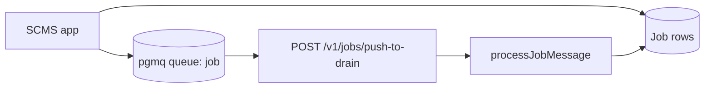
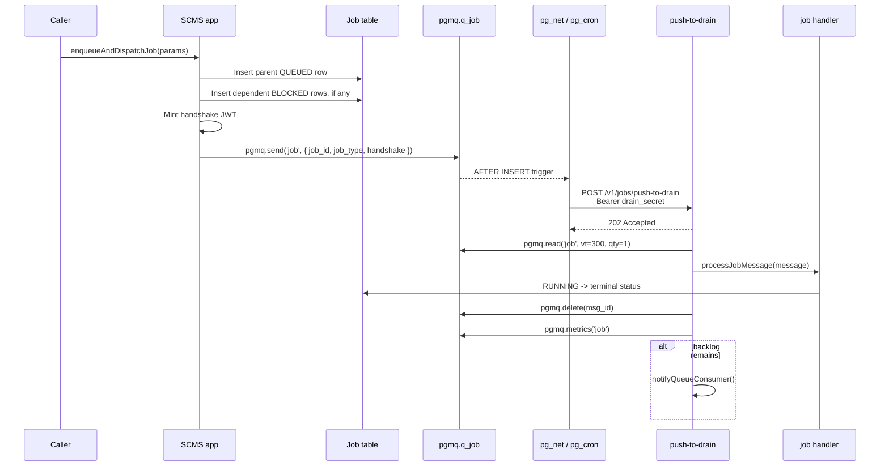
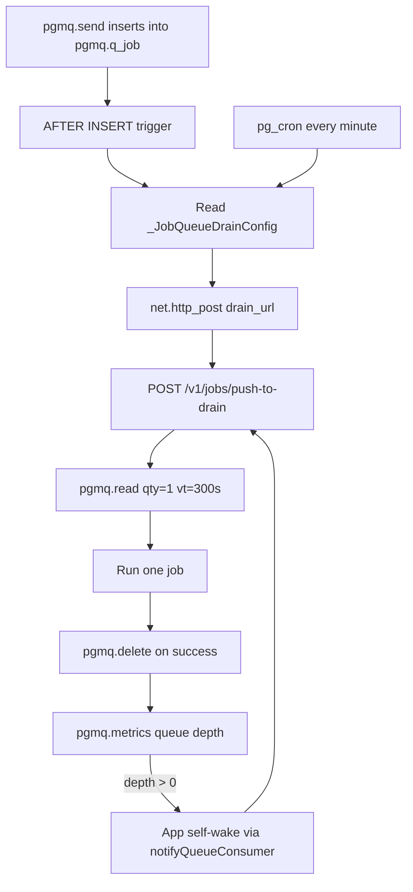
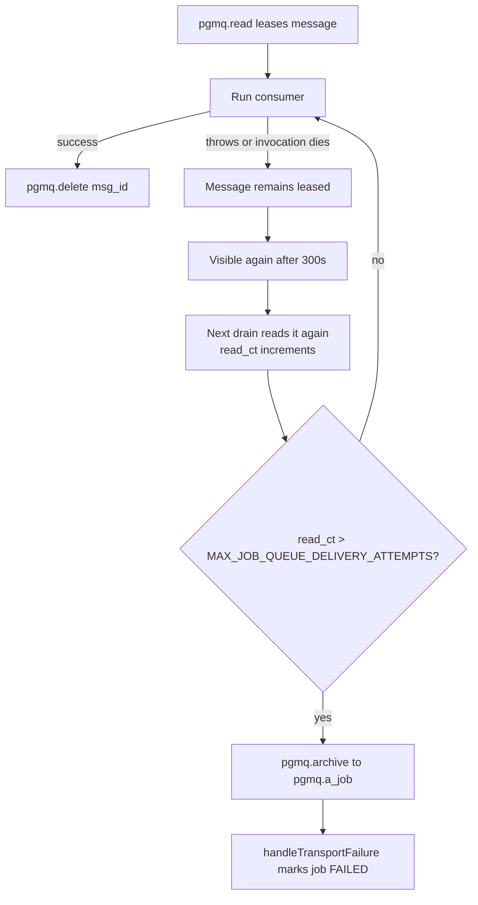
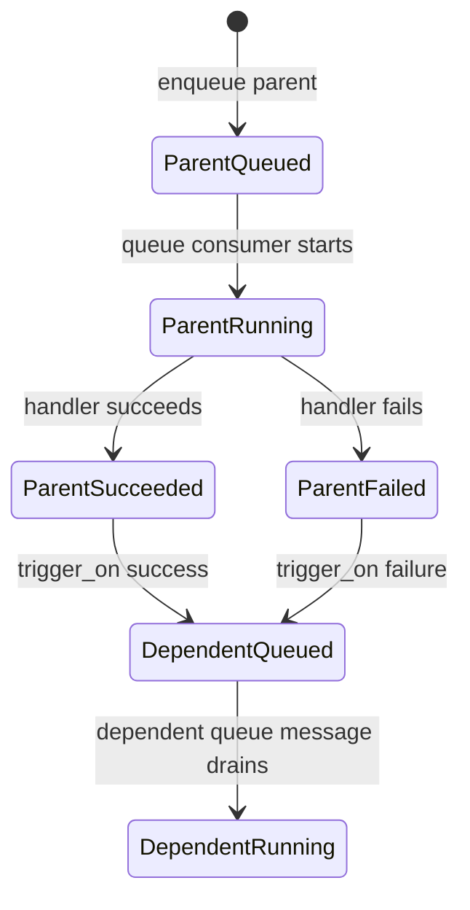

# Queues and Jobs Architecture

This guide is the developer-facing overview of how SCMS jobs run now that
internal dispatch uses **Supabase pgmq**. It explains the complete path from
creating a job row to running the handler, how the queue wakes the consumer, and
what happens in common success and failure cases.

For deployment steps, see
[`platform/scms/deploy/supabase-job-queue-setup.md`](../../platform/scms/deploy/supabase-job-queue-setup.md).
For branch-review notes, see
[`docs/jobs/review-supabase-queues.md`](./review-supabase-queues.md).

## Core Model

SCMS has two related but separate concepts:

- A **job row** is the durable application record in Prisma/Postgres. It tracks
  lifecycle state (`QUEUED`, `RUNNING`, `FAILED`, terminal follow-ons, blocked
  dependents, activity metadata, and results).
- A **queue message** is the transport record in `pgmq.q_job`. It tells the
  consumer which job row to execute. The message body contains `job_id`,
  `job_type`, and a short-lived handshake JWT.

The queue is **Supabase pgmq** everywhere: local dev, staging, and production.
There is no mock queue, provider selection, Pub/Sub dispatch topic, or in-memory
fallback for internal job dispatch.



## Important Pieces

| Piece | Role |
| --- | --- |
| `enqueueAndDispatchJob` | Creates the parent job row, creates any blocked dependents, mints the handshake token, and dispatches the parent queue message. |
| `dispatchJob` | Thin wrapper around `sendJobMessage`; enqueue only. It does not wake the consumer directly. |
| `pgmq.send` / `pgmq.q_job` | Durable Postgres-backed queue storage. |
| `pgmq_job_enqueue_wake_trigger` | Database trigger on `pgmq.q_job` that wakes the drain route after enqueue. |
| `_JobQueueDrainConfig` | Single-row table containing the drain URL and secret used by `pg_net` and `pg_cron`. |
| `POST /v1/jobs/push-to-drain` | Authenticated drain route. Returns `202` immediately and drains one message in the background. |
| `drainOneJob` | Reads one pgmq message, runs the consumer, acks on success, and chains another wake if backlog remains. |
| `processJobMessage` | Validates the handshake, marks/runs the job, dispatches handler-specific work, and manages terminal outcomes. |
| `System -> Jobs -> Queues` | Admin tab for drain config, queue tail, and manual backlog draining. |

## End-To-End Flow



The key design choice is that **Postgres wakes the consumer after enqueue**.
`dispatchJob` does not make an app-side HTTP call. The app-side wake is only
used after a successful drain when the queue still has more work.

## Wake And Drain Mechanics

The migration creates the `job` pgmq queue, `_JobQueueDrainConfig`,
`job_queue_cron_drain()`, a statement-level trigger on `pgmq.q_job`, and a
`pg_cron` backup schedule when `pg_cron` is available.



`_JobQueueDrainConfig` is therefore required for the primary wake, not just for
the backup cron. If the row is missing, has the wrong URL, or has a secret that
does not match `api.queueConsumerSecret`, jobs may sit in the queue until a
human fixes config or drains manually.

### Why One Message Per Drain?

`push-to-drain` processes one message per invocation (`pgmq.read(..., 1)`) and
then chains another wake when depth remains. This keeps each invocation bounded,
matches the 300 second Vercel `maxDuration`, and lets pgmq visibility timeout
protect the message if a handler crashes.

## Auth Boundaries

There are two authentication checks in the architecture:

- **Wake auth:** `POST /v1/jobs/push-to-drain` requires
  `Authorization: Bearer {api.queueConsumerSecret}`. The database sends the
  value stored in `_JobQueueDrainConfig.drain_secret`; the app chain wake sends
  `api.queueConsumerSecret` directly.
- **Execution auth:** the queue message carries a handshake JWT created with
  `api.handshakeSigningSecret`. The consumer validates it before running the job
  handler.

This means a caller cannot execute arbitrary jobs just by reaching the drain
route, and a queue message still needs a valid job-scoped handshake before it can
run.

## Idempotency

`pgmq` does not provide native idempotency, so `sendJobMessage` implements it
around `job_id`:

1. Take a transaction-scoped advisory lock keyed by the idempotency key.
2. Insert with `pgmq.send` only if `pgmq.q_job` does not already contain a
   pending or in-flight message for that `job_id`.
3. If a message already exists, return that message id instead of enqueueing a
   duplicate.

This protects client retries, especially `POST /v1/jobs` retries where the job
row already exists but a second queue message would otherwise run the same job
concurrently.

## Failure And Retry Behavior



There is no `nack`. A failed consumer simply does not delete the message. pgmq
makes it visible again after the visibility timeout, and `read_ct` tracks how
many times it has been delivered.

When `read_ct` exceeds `MAX_JOB_QUEUE_DELIVERY_ATTEMPTS`, `readOneJobMessage`
dead-letters the message by archiving it to `pgmq.a_job`, marking the job
`FAILED` via `handleTransportFailure`, and moving on to the next queue message.
A poison message should never block the whole queue.

## Dependency And Follow-On Jobs

`enqueueAndDispatchJob` can create dependent jobs as `BLOCKED` rows. Only the
parent is sent to pgmq immediately. Dependents are released by job terminal
handling when the parent reaches the configured trigger state.



This keeps dependency state in the job table rather than in pgmq. The queue only
contains runnable work.

## Example Cases

### 1. Normal Check Job

1. UI or API calls `enqueueAndDispatchJob` with `job_type = CHECK`.
2. SCMS creates a `QUEUED` job row and sends one pgmq message.
3. The `pgmq.q_job` trigger calls `POST /v1/jobs/push-to-drain`.
4. The drain route leases the message, validates the handshake, and starts the
   check handler.
5. The handler publishes any worker-specific work it still owns.
6. The queue message is deleted after the SCMS consumer succeeds.

### 2. Backlog Of Several Jobs

1. Several jobs are enqueued quickly.
2. Each enqueue schedules a database wake, but every drain processes only one
   message.
3. After each successful drain, SCMS checks `pgmq.metrics('job')`.
4. If depth is still positive, `notifyQueueConsumer()` calls the drain route
   again from the app.
5. The backlog drains as a chain of bounded invocations.

### 3. Dev Server Was Down During Enqueue

1. Postgres enqueues the message and the trigger tries to call the configured
   drain URL.
2. If the local dev server is down, the HTTP wake fails.
3. The message remains in `pgmq.q_job`.
4. When the server comes back, the once-per-minute `pg_cron` backup can wake the
   route, or an admin can open `/app/system/jobs?tab=queues` and click
   **Drain now**.

### 4. Handler Keeps Failing

1. The consumer leases the message and the handler throws.
2. The message is not deleted.
3. After 300 seconds, the message becomes visible and another drain can retry it.
4. Once the delivery count exceeds `MAX_JOB_QUEUE_DELIVERY_ATTEMPTS`, the message
   is archived to `pgmq.a_job` and the job is marked `FAILED`.

### 5. Retried Enqueue With The Same Job ID

1. A client retries a job creation request with the same `job_id`.
2. `ensureJobRow` leaves the existing job row alone.
3. `sendJobMessage` takes the advisory lock and sees a pending or in-flight
   pgmq message for that `job_id`.
4. It returns the existing message id and does not insert another queue message.

### 6. CLI-Tracked Job

`CLI_CHECK` is row-tracked but not queue-consumed by SCMS. The job row is
created, but `enqueueAndDispatchJob` skips pgmq dispatch because the CLI drives
the lifecycle through authenticated PATCH calls.

## Local Development

Local development uses the same queue architecture as staging and production.
The Docker Postgres image in `docker/postgres/Dockerfile` installs `pgmq`,
`pg_net`, and `pg_cron`, and binds the background workers to the `journals`
database.

Use:

```bash
npm run db:up
npm run dev:db:reset
```

After pulling queue-infra changes that modify the Docker image, rebuild once:

```bash
npm run db:rebuild
npm run dev:db:reset
```

The dev seed populates `_JobQueueDrainConfig` from app-config. In Docker dev,
`api.tasksCallbackUrl` should point at the host from inside the container, for
example `http://host.docker.internal:3031/v1`. That is why the stored drain URL
can differ from `api.url`: `pg_net` is running inside Postgres, while
`notifyQueueConsumer()` is the app calling itself.

## Operations And Debugging

Use **System -> Jobs -> Queues** for day-to-day inspection:

- Confirm whether `_JobQueueDrainConfig` is configured.
- Confirm whether the stored secret matches `api.queueConsumerSecret`.
- Save the drain endpoint.
- Push the app-config secret into the database row.
- View pending and in-flight pgmq messages.
- Click **Drain now** to process up to 10 messages in-process when HTTP wakes are
  misconfigured or delayed.

Useful SQL checks:

```sql
SELECT * FROM pgmq.metrics('job');

SELECT msg_id, read_ct, enqueued_at, vt, message
FROM pgmq.q_job
ORDER BY msg_id DESC
LIMIT 25;

SELECT id, drain_url, length(drain_secret) AS secret_length
FROM "_JobQueueDrainConfig";

SELECT jobid, jobname, schedule, command
FROM cron.job
WHERE jobname = 'job-queue-drain-backup';
```

Common symptoms:

- **Queue length grows, no drains:** check `_JobQueueDrainConfig`, the drain URL,
  and the secret match.
- **`401` from push-to-drain:** database `drain_secret` and app
  `api.queueConsumerSecret` differ, or the app was not redeployed after a secret
  change.
- **Local queue does not wake:** confirm Docker Postgres is the custom image and
  `api.tasksCallbackUrl` uses `host.docker.internal`.
- **Repeated retries:** inspect logs for the job handler error and check
  `read_ct` in `pgmq.q_job`.
- **Poison message disappeared from active queue:** inspect `pgmq.a_job`; it was
  probably dead-lettered after exceeding delivery attempts.

## What Not To Add

Do not add a second internal dispatch transport unless the architecture changes
intentionally. In particular:

- Do not reintroduce a mock/in-memory provider for normal dev or test behavior.
- Do not make `dispatchJob` self-call `push-to-drain` after enqueue; that would
  duplicate the database-fired wake.
- Do not put dependency state in pgmq messages; keep dependency lifecycle in the
  job rows.
- Do not expose `_JobQueueDrainConfig.drain_secret` through admin UI or logs.
