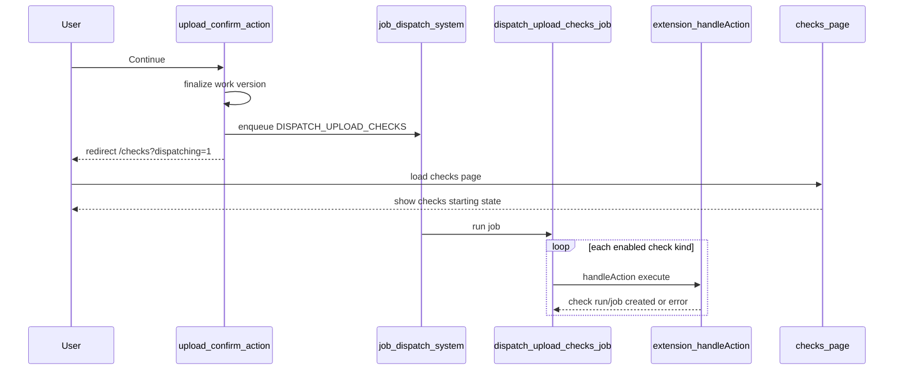

# Follow-up Plan: Upload Checks Job Dispatch

## Goal

After the broader job dispatch system changes land, replace the upload route's background `waitUntil` check dispatch with a first-class job-driven path. The upload confirmation should still redirect quickly, but dispatch should become observable, retryable, and aligned with the platform's job infrastructure.

This is a follow-up to the immediate Option A change, where `confirm-work` schedules the current check dispatch loop with `waitUntil`.

## Current baseline

The upload route currently owns the upload confirmation flow in [`platform/scms/app/routes/app/works.$workId.upload.$workVersionId/route.tsx`](../../platform/scms/app/routes/app/works.$workId.upload.$workVersionId/route.tsx).

For `intent=confirm-work`, it:

1. Reads `metadata.checks.enabled`.
2. Writes check metadata placeholders.
3. Sets the work version `draft` flag to `false`.
4. Dispatches each enabled extension check by calling `service.handleAction({ intent: 'execute', workVersionId, ctx, serverExtensions })`.
5. Redirects to the checks page when checks were enabled.

The immediate Option A implementation moves step 4 behind `waitUntil`, but still uses the same extension dispatch loop.

## Proposed job model

Add one platform orchestration job for upload check dispatch:

| Item | Proposed value |
|---|---|
| Job type | `DISPATCH_UPLOAD_CHECKS` or equivalent |
| Granularity | One orchestration job per confirmed upload/version |
| Payload | `{ workVersionId, workId, kinds, requestedById }` |
| Job responsibility | Dispatch all enabled checks for the work version |
| Extension responsibility | Continue owning check-specific run rows, external submissions, and downstream jobs |

The orchestration job should not replace extension check jobs. It replaces the upload route as the caller that invokes each extension's `handleAction`.

## Target flow

## Design decisions

- Use a **single orchestration job** for the upload confirmation, not one platform job per check kind by default.
- Capture `kinds` at confirmation time so later metadata edits do not change what the confirmed upload requested.
- Keep extension `handleAction` as the check-specific contract. The platform job should orchestrate, not reimplement Proofig, text integrity, relay, or iThenticate behavior.
- Reuse the same shared dispatch helper introduced for Option A if it remains a good fit.
- Surface job failures through the job/activity system rather than the upload form fetcher, since the user will already have navigated.

## Alternative considered

Enqueue one platform job per check kind. This gives independent retries and per-check job visibility, but it adds aggregation questions and more rows for a single upload action. It may still be useful later if checks have very different runtime characteristics or retry policies.

## Implementation sketch

1. Define the new job type and payload schema in the core/server job registration area used by SCMS jobs.
2. Add a job handler that:
   - validates the work version exists and is non-draft,
   - resolves enabled/configured extension check services,
   - filters to the captured `kinds`,
   - invokes each service's `handleAction({ intent: 'execute', workVersionId, ctx, serverExtensions })`,
   - records per-kind failures in job messages/results.
3. Update `confirm-work` to enqueue this job after the work version is finalized.
4. Keep redirect behavior fast: `/app/works/:workId/checks?dispatching=1`.
5. Update the checks page pending state to prefer the orchestration job status when available, falling back to the query-param/revalidation behavior.
6. Remove the Option A `waitUntil` dispatch path once the job route is stable.

## Open questions

- Should a failed dispatch for one check stop the orchestration job immediately, or should the job attempt all requested checks and report a partial failure?
- Should the platform create a synthetic queued/pending `checkServiceRun` row before calling extensions, or should that remain fully extension-owned?
- What should retries do when one extension already created a run and another failed? The dispatch helper likely needs idempotency guards or extension-level idempotency expectations.
- Should the orchestration job be visible in the work activity timeline, or only in operational job views?

## Relationship to broader job-dispatch work

This plan should wait until the job dispatch system changes are in place. In particular, it should align with the centralized dispatch approach described in [`docs/jobs/plan-job-dispatch.md`](../jobs/plan-job-dispatch.md), rather than adding another one-off background mechanism.
