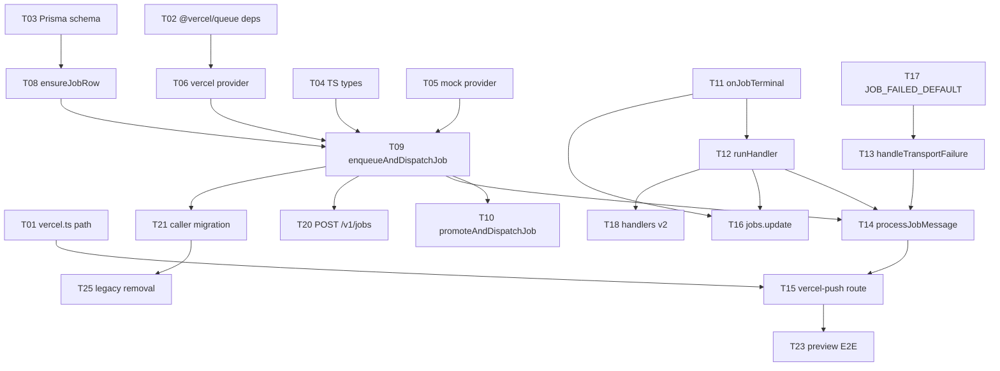

# Job Dispatch — Vercel Queues Implementation Plan (PRIMARY)

> **Status:** ✅ Approved — ready for subagent execution on **Go** signal  
> **Design spec:** [2026-06-15-job-manager-vercel-queues-design.md](../specs/2026-06-15-job-manager-vercel-queues-design.md)  
> **Execution skill:** `superpowers:subagent-driven-development` — one implementer subagent per task, spec review + code review between tasks

---

## Decision record

| Decision | Choice |
|---|---|
| Transport | **Vercel Queues** — topic `job` |
| Consumer | **`POST /v1/jobs/vercel-push`** via `handleCallback` |
| Local dev | **Mock queue** default (`QUEUES_PROVIDER=mock`); opt-in real queues via `vercel env pull` |
| Auth (enqueue) | **`POST /v1/jobs`** — user session or CLI token (`ctx.user` required) |
| Auth (execute) | **Handshake JWT** in queue message — `aud` = job_type scope |
| Execution model | **Async-only** — retire `jobs.invoke` |

---

## Goal

Replace Pub/Sub dispatch with Vercel Queues. Unified job API: `enqueueAndDispatchJob` → `dispatchJob` → (mock or Vercel) → `processJobMessage` → `runHandler`. Dependent jobs as **`BLOCKED`** rows promoted by `onJobTerminal`.

**Tech stack:** TypeScript, Prisma, `@vercel/queue`, React Router v7, `@vercel/react-router`, Vitest.

---

## Before Go — coordinator setup (parent agent)

1. **Worktree / branch** (from `dev`):

   ```bash
   npm run wt:create mnt/vercel-queues-jobs
   # or: npm run wt:create mnt/vercel-queues-jobs --existing  # if branch exists
   ```

2. **Prerequisite (preview/prod only):** Vercel Queues enabled on SCMS project.

3. **On Go signal:** parent agent creates TodoWrite from task list below, dispatches **Task 01** implementer subagent with full task text + links to design spec sections.

4. **Per task:** implement → `npm run lint` + format rules → commit (emoji message) → spec reviewer subagent → code reviewer subagent → mark todo complete → next task.

5. **Do not start** until user says **Go**.

---

## Task dependency graph



---

## File map

| File | Responsibility |
|---|---|
| `prisma/schema/job.prisma` | `BLOCKED`, `depends_on_job_id`, `trigger_on` |
| `packages/scms-core/.../jobs/types.ts` | `EnqueueJobParams`, `DependentJobSpec` |
| `packages/scms-server/.../jobs/enqueue/queueProviders/*.server.ts` | `mock`, `vercel`, `pubsub` (legacy) |
| `packages/scms-server/.../jobs/enqueue/dispatchJob.server.ts` | Provider delegate |
| `packages/scms-server/.../jobs/enqueue/enqueueAndDispatchJob.server.ts` | Public enqueue API + handshake mint |
| `packages/scms-server/.../jobs/run/processJobMessage.server.ts` | Handshake verify + runHandler |
| `packages/scms-server/.../jobs/run/runHandler.server.ts` | Handler execution + terminal hooks |
| `packages/scms-server/.../jobs/run/handleTransportFailure.server.ts` | App-level DLQ |
| `platform/scms/vercel.ts` | Queue trigger → vercel-push |
| `platform/scms/app/routes/api/v1.jobs.vercel-push/route.tsx` | `handleCallback` consumer |
| `platform/scms/app/routes/api/v1.jobs.tsx` | User-auth enqueue (not invoke) |

---

## Phase 0 — Vercel wiring

### Task 01: Verify compiled function path + vercel.ts

**Files:** `platform/scms/vercel.ts` (create)

- [ ] `cd platform/scms && npm run build:prod`
- [ ] Find compiled path: `find .vercel/output -name '*vercel-push*' 2>/dev/null || find build -name '*vercel-push*'`
- [ ] Create `vercel.ts` with `experimentalTriggers` for topic `job` → verified function key
- [ ] Commit: `⚙️ Add vercel.ts queue consumer for topic job`

### Task 02: Install @vercel/queue + local dev docs

**Files:** `platform/scms/package.template.json`, `platform/scms/README.md`

- [ ] Add `@vercel/queue`, `@vercel/config` (latest at install time); root `npm install`
- [ ] Document mock default + opt-in `QUEUES_PROVIDER=vercel` + `vercel env pull`
- [ ] Commit: `📦 Add @vercel/queue dependency`

---

## Phase A — Schema and types

### Task 03: Prisma job dependency schema

**Files:** `prisma/schema/job.prisma`

- [ ] Add `BLOCKED` to `JobStatus`, `JobTriggerOn` enum, `depends_on_job_id`, `trigger_on`, self-relation, index
- [ ] `npm run prisma:migrate -- --name job_dependencies`
- [ ] Commit: `🗄️ Add BLOCKED status and job dependency columns`

### Task 04: TypeScript job API types

**Files:** `packages/scms-core/.../jobs/types.ts`, `packages/scms-server/.../jobs/types.ts`

- [ ] Add `DependentJobSpec`, `EnqueueJobParams`, `EnqueueJobResult` (`status: 'DISPATCHED'`)
- [ ] Commit: `📝 Add EnqueueJobParams and DependentJobSpec types`

---

## Phase B — Queue providers + enqueue API

### Task 05: Mock queue provider (default local dev)

**Files:**
- `packages/scms-server/.../enqueue/queueProviders/types.ts` — `JobQueueMessage { job_id, job_type, handshake }`
- `packages/scms-server/.../enqueue/queueProviders/mock.server.ts`
- `packages/scms-server/.../enqueue/queueProviders/index.server.ts` — `getJobQueueProvider()` defaults `mock` in dev, `vercel` when `VERCEL=1`
- `packages/scms-server/.../enqueue/dispatchJob.server.ts`
- `packages/scms-server/tests/jobs/mockQueueProvider.test.ts`

- [ ] Mock: FIFO, `setImmediate`, idempotency set, retry max 5 → `processJobMessage` (mocked in test)
- [ ] Run: `npm run test -w @curvenote/scms-server -- mockQueueProvider`
- [ ] Commit: `🧪 Add mock queue provider for local dev`

### Task 06: Vercel queue provider

**Files:** `queueProviders/vercel.server.ts`, `tests/jobs/dispatchJob.vercel.test.ts`

- [ ] `send('job', message, { idempotencyKey: job_id })` including handshake in payload
- [ ] Run tests; commit: `📤 Add Vercel queue provider`

### Task 07: Legacy Pub/Sub provider adapter

**Files:** `queueProviders/pubsub.server.ts` (extract from `dispatch/dispatch.ts`)

- [ ] Wrap existing `sendDispatchMessage` for `QUEUES_PROVIDER=pubsub` / flag transition
- [ ] Commit: `🔌 Add pubsub queue provider for transition`

### Task 08: ensureJobRow

**Files:** `enqueue/ensureJobRow.server.ts`, `tests/jobs/ensureJobRow.test.ts`

- [ ] Idempotent insert `QUEUED` or `BLOCKED` with dependency fields
- [ ] Commit: `✅ Add ensureJobRow`

### Task 09: enqueueAndDispatchJob

**Files:** `enqueue/enqueueAndDispatchJob.server.ts`, `dependencies/followOnFromEnvelope.server.ts`, `tests/jobs/enqueueAndDispatchJob.test.ts`

- [ ] Transaction: parent `QUEUED` + dependents `BLOCKED`
- [ ] Legacy: `follow_on` → dependents via `followOnFromEnvelope`
- [ ] Mint `createHandshakeToken(job_id, job_type, …)` → `dispatchJob({ job_id, job_type, handshake })` **parent only**
- [ ] Feature flag `asyncDispatch.provider`: `mock` | `vercel` | `pubsub`
- [ ] Deprecate `dispatchAJob` alias
- [ ] Commit: `🚀 Add enqueueAndDispatchJob`

### Task 10: promoteAndDispatchJob

**Files:** `enqueue/promoteAndDispatchJob.server.ts`, tests

- [ ] `BLOCKED` → `QUEUED`, re-mint handshake, `dispatchJob`
- [ ] Commit: `⏫ Add promoteAndDispatchJob`

---

## Phase C — Consumer + runHandler

### Task 11: onJobTerminal

**Files:** `dependencies/onJobTerminal.server.ts`, tests

- [ ] COMPLETED: promote SUCCESS dependents, cancel FAILURE
- [ ] FAILED: opposite; `JOB_FAILED_DEFAULT` if no failure dependents
- [ ] Commit: `🔗 Add onJobTerminal`

### Task 12: runHandler

**Files:** `run/runHandler.server.ts`; optionally delegate from `v1.jobs.dispatch/route.tsx` during transition

- [ ] Skip if status !== `QUEUED`; run registry handler; work activity; call `onJobTerminal` on terminal status
- [ ] Commit: `▶️ Add runHandler`

### Task 13: handleTransportFailure

**Files:** `run/handleTransportFailure.server.ts`, tests

- [ ] Extract from `v1.jobs.dispatch/dlq.route.tsx` — terminalize + `enqueueAndDispatchJob(JOB_FAILED_DEFAULT)`
- [ ] Commit: `💀 Add handleTransportFailure`

### Task 14: processJobMessage

**Files:** `run/processJobMessage.server.ts`, tests

- [ ] Verify handshake: `claims.jobId === job_id`, `claims.aud === job_type` — auth failure = permanent (no retry)
- [ ] Call `runHandler`; on throw at max delivery → `handleTransportFailure`
- [ ] Used by **mock provider** and **vercel-push route** (same path)
- [ ] Commit: `🔗 Add processJobMessage`

### Task 15: /v1/jobs/vercel-push route

**Files:**
- `platform/scms/app/routes/api/v1.jobs.vercel-push/route.tsx`
- `platform/scms/app/routes.ts` — `route('jobs/vercel-push', …)` **before** `jobs/:jobId`
- `platform/scms/vercel.ts` — confirm function path from Task 01

- [ ] Thin `handleCallback` → `processJobMessage`; `maxDuration: 300`; retry policy max 5
- [ ] Resolve React Router + `handleCallback` typing if needed (`handleNodeCallback` fallback)
- [ ] Integration: mock provider `enqueueAndDispatchJob(LOOPBACK)` → COMPLETED
- [ ] Commit: `▶️ Add Vercel Queue consumer on /v1/jobs/vercel-push`

### Task 16: Wire jobs.update

**Files:** `loaders/jobs/update.server.ts`

- [ ] Replace `triggerFollowOn` + `invoke` with `onJobTerminal` on COMPLETED/FAILED
- [ ] Commit: `🔄 jobs.update uses onJobTerminal`

---

## Phase D — Handlers

### Task 17: JOB_FAILED_DEFAULT handler

**Files:** `handlers/job-failed-default.server.ts`, `KnownJobTypes`

- [ ] Idempotent terminalize + log
- [ ] Commit: `🧹 Add JOB_FAILED_DEFAULT handler`

### Task 18: Handler v2 (core)

**Files:** `check`, `converter-task`, `publish`, `unpublish`, `loopback`, `checkCLIHandler`

- [ ] Remove `dbCreateJob`; assume `QUEUED` row exists; idempotent skip
- [ ] Commit: `♻️ Handlers v2: no dbCreateJob`

### Task 19: Extension job handlers audit

- [ ] Audit `registerExtensionJobs`; apply v2 contract where needed
- [ ] Commit per extension or single: `♻️ Extension handlers v2`

---

## Phase E — Caller migration

### Task 20: POST /v1/jobs → enqueue only

**Files:** `platform/scms/app/routes/api/v1.jobs.tsx`

- [ ] Replace `jobs.invoke` with `enqueueAndDispatchJob`; keep `ctx.user` auth
- [ ] Schema: add `dependents[]`; return `{ job_id, status: 'DISPATCHED' }`
- [ ] Commit: `📮 POST /v1/jobs enqueues async only`

### Task 21: Migrate internal callers

**Files:** `transition.server.ts`, `actionHelpers.server.ts`, `system.jobs/route.tsx`, extension dispatch paths

- [ ] Remove `waitUntil(fetch('/v1/jobs'))` → `enqueueAndDispatchJob`
- [ ] PUBLISH/UNPUBLISH/CONVERTER_TASK paths
- [ ] Commit: `🔀 Migrate callers to enqueueAndDispatchJob`

### Task 22: Feature flag defaults

**Files:** app-config schema, `enqueueAndDispatchJob`

- [ ] Dev default: `mock`; Vercel preview/prod: `vercel`; prod transition: `pubsub` until cutover
- [ ] Commit: `🚩 asyncDispatch.provider feature flag`

---

## Phase F — Deploy, E2E, observability

### Task 23: Preview deploy + E2E

- [ ] Enable Vercel Queues on preview; `asyncDispatch.provider=vercel`
- [ ] Confirm `vercel.ts` trigger in deployment
- [ ] Checklist:
  - [ ] LOOPBACK via real queue
  - [ ] Parent + BLOCKED dependent chain
  - [ ] Parent FAILED → failure dependent / cancel success dependents
  - [ ] Poison → `handleTransportFailure` → `JOB_FAILED_DEFAULT`
  - [ ] Invalid handshake / wrong `aud` → no handler run
  - [ ] Duplicate delivery idempotent
  - [ ] Local mock: single terminal LOOPBACK
  - [ ] Local opt-in: `QUEUES_PROVIDER=vercel`
- [ ] Commit: `✅ Vercel Queues E2E verified`

### Task 24: Observability + runbook

- [ ] Log `job_id`, `messageId`, `deliveryCount`, `topicName: job`
- [ ] Runbook in `platform/scms/README.md` or `docs/jobs/`
- [ ] Commit: `📋 Vercel Queues runbook`

---

## Phase G — Legacy removal (after prod stable)

### Task 25: Retire legacy dispatch

- [ ] Remove `invoke.server.ts`, `trigger-follow-on.server.ts`
- [ ] Remove or gate `/v1/jobs/dispatch` Pub/Sub routes
- [ ] Remove `follow_on` from create schema when callers migrated
- [ ] Commit: `🗑️ Remove invoke and Pub/Sub dispatch`

---

## Subagent dispatch template

For each task, parent agent sends implementer subagent:

```
Implement Task NN from docs/superpowers/plans/2026-06-15-job-manager-vercel-queues.md

Branch: mnt/vercel-queues-jobs
Design spec: docs/superpowers/specs/2026-06-15-job-manager-vercel-queues-design.md

Constraints:
- Handshake JWT required in queue messages (aud = job_type)
- Mock queue default for local dev
- POST /v1/jobs stays user-authenticated enqueue
- Run npm run lint + format after changes; commit with emoji

Paste full Task NN section from plan.

Return: DONE | DONE_WITH_CONCERNS | NEEDS_CONTEXT | BLOCKED + summary + commit SHA
```

---

## Spec coverage

| Requirement | Task |
|---|---|
| Topic `job`, consumer vercel-push | 01, 15 |
| vercel.ts (not vercel.json) | 01 |
| Mock local dev | 05, 02 README |
| Real Vercel local opt-in | 02, 06, 23 |
| Handshake mint + verify | 09, 10, 14 |
| Dependency rows | 03, 04 |
| enqueueAndDispatchJob / dispatchJob / runHandler | 08–12, 14 |
| App-level DLQ | 13, 14 |
| User-auth POST /v1/jobs | 20 |

---

## Go signal

When ready, reply **Go**. Coordinator will:

1. Ensure worktree on `mnt/vercel-queues-jobs`
2. Create TodoWrite for Tasks 01–25
3. Dispatch Task 01 implementer subagent
4. Run two-stage review after each task until complete or blocked

**Do not implement before Go.**
