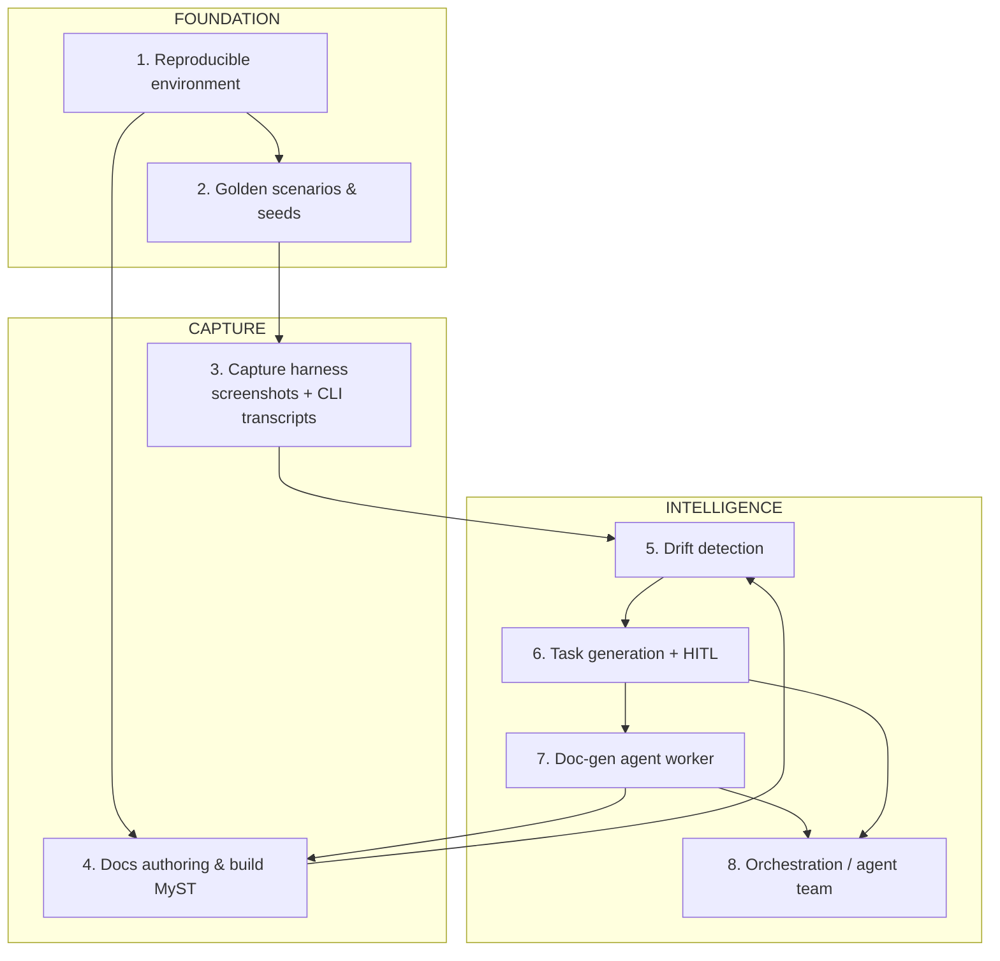
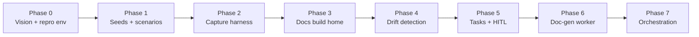

# Automated Documentation Factory — Vision & Roadmap

> **Status:** Vision / umbrella roadmap. This document maps the whole system and
> sequences the work. Each numbered subsystem gets its own
> `docs/superpowers/specs/<date>-<topic>-design.md` spec and implementation plan.
> Nothing here is a commitment to build all of it — it is the map we cut
> sub-projects from.

## 1. Goal

Stand up a repeatable "documentation factory" rooted in this monorepo that can:

1. Get the latest repo at a known git ref, **build and run** the SCMS platform and
   the Curvenote CLI in a **reproducible, seeded** environment.
2. Detect **documentation drift** — both from commits/PRs (surface changes) and
   from **behaviour changes** observed by running the software.
3. Turn drift into **structured documentation-update tasks**.
4. With a **human in the loop** to accept a task, have an agent (or agent team)
   **generate new/updated documentation including screenshots** and **open a docs
   PR** for review.

First-priority documentation targets: **SCMS** and the **Curvenote CLI**.

## 2. Principles

- **Bottom-up.** The agent "factory" logic is worthless without a reproducible,
  seeded, runnable system. Build the foundation first.
- **Determinism over cleverness.** Same ref + same seed ⇒ same UI, same CLI
  output, same screenshots. Drift detection and screenshot diffing are only
  meaningful if the baseline is stable (fixed IDs, dates, users, ordering).
- **Dogfood MyST.** Docs are authored/built in `mystmd`, which lives in this repo.
- **Reuse, don't rebuild.** Storage → MinIO (SCMS already has an S3 provider).
  DB → existing `docker-compose` + Prisma seeds. Env → existing scripts.
- **Human-in-the-loop by default.** Agents propose tasks and PRs; humans accept
  tasks and merge. No auto-merge of docs.
- **Each subsystem is independently useful.** Every phase should deliver value on
  its own, even if later phases are never built.

## 3. Non-goals (initially)

- Auto-merging documentation PRs.
- Documenting every package in the monorepo (scope is SCMS + CLI first).
- A hosted multi-tenant "docs SaaS" — this is an internal factory first.
- Replacing human technical writers — this augments and drafts for them.

## 4. Current repo assets we build on

| Need | Existing asset |
| --- | --- |
| Local DB | `docker-compose.yml` (`scms-postgres` w/ pgmq/pg_net/pg_cron), `npm run db:up`/`db:rebuild` |
| DB schema + data | Prisma migrations, `npm run dev:db:seed`, `dev:db:reset` |
| Storage | SCMS `IStorageProvider` with **S3** impl → local **MinIO** maps directly |
| Doc tooling | `mystmd` packages in-repo (MyST build, structured AST) |
| CLI | `packages/curvenote` (`npm run build:cli`, `npm run link:cli`) |
| API surface | Zod schemas in SCMS (candidate for schema-diff drift signal) |
| Existing e2e | `platform/scms/tests/e2e/*` (spec + yml suites, `__snapshots__`) |
| Job orchestration precedent | pgmq queue + drain pattern (`docs/jobs/queues-and-jobs.md`) |

Gaps (greenfield): **no browser/screenshot tooling** (Playwright not present),
no storage-in-compose yet, no drift-detection or task-generation layer, no
docs-agent worker.

## 5. Subsystem map

### Subsystem 1 — Reproducible environment (FOUNDATION)

**Purpose:** one command brings up SCMS + CLI at a given git ref against a
disposable, fully local backing stack.

- Extend `docker-compose` with **MinIO** (S3 API) + bucket bootstrap for the six
  logical buckets (`staging`, `hashstore`, `tmp`, `cdn`, `prv`, `pub`).
- App-config profile for "local factory" that points storage at MinIO and DB at
  the compose Postgres.
- A single entrypoint (e.g. `npm run factory:up`) that: starts compose → migrates
  → seeds → builds/links CLI → starts SCMS. Optionally pinned to a ref/worktree.
- **Key decisions:** MinIO vs LocalStack (recommend MinIO — matches S3 provider,
  lighter); one compose stack vs per-environment (dev/test/docs) stacks.

### Subsystem 2 — Golden scenarios & seeds (FOUNDATION)

**Purpose:** deterministic source material so docs/screenshots are stable.

- Curated fixtures + scripted flows for the canonical journeys: **import**,
  **submit**, **publish** (the three the user called out).
- Deterministic seeds: fixed UUIDs, fixed timestamps, fixed users/orgs, stable
  ordering. A "clock" and ID strategy that removes run-to-run variance.
- Scenarios expressed as reusable steps callable by both the capture harness and
  humans ("run scenario `submit-article` against a fresh env").
- **Key decisions:** fixtures-as-SQL vs fixtures-as-API-calls (recommend
  API/CLI-driven so scenarios double as behaviour tests and stay realistic).

### Subsystem 3 — Capture harness (CAPTURE)

**Purpose:** turn a running, seeded system into doc source material.

- **Playwright** driving SCMS UI: deterministic viewport, masked/frozen dynamic
  regions (dates, timers), stable theming, targeted element screenshots.
- **CLI transcript capture**: run commands, capture stdout/exit, normalise
  volatile tokens, store as reusable snippets.
- Named "capture recipes" tied to golden scenarios; output goes to a predictable
  artifact location the docs build and the diffing layer can consume.
- **Key decisions:** full-page vs component screenshots; where artifacts live
  (in-repo committed baselines vs artifact store).

### Subsystem 4 — Docs authoring & build (CAPTURE)

**Purpose:** a single home + build for SCMS and CLI docs.

- Consolidate today's scattered docs (`platform/scms/docs`, `mystmd/docs`, root
  `docs/*`) into a coherent MyST docs project (or clearly federated projects).
- Conventions for embedding captured screenshots + CLI transcripts.
- CLI reference partly **generated** from the CLI's own command/`--help` metadata.
- **Key decisions:** one docs site vs SCMS-docs + CLI-docs; how much reference is
  generated vs hand-authored.

### Subsystem 5 — Drift detection (INTELLIGENCE)

**Purpose:** given a new commit/PR, decide what docs are now stale.

Signal taxonomy (cheap → expensive):

| Signal | Source | Detects |
| --- | --- | --- |
| Changeset scan | `.changeset/*.md` | Declared user-facing changes |
| CLI surface diff | `curvenote --help` tree at ref A vs B | Added/removed/renamed commands & flags |
| API/schema diff | SCMS Zod schemas / routes | Endpoint & payload changes |
| Route/UI-map diff | React Router route inventory | New/removed/renamed pages |
| Screenshot diff | Capture harness baselines | Visual/behavioural change on a documented flow |
| Doc back-reference | Docs → code symbols | Docs pointing at changed/removed symbols |

- Output: a normalised set of **drift findings** (what changed, confidence,
  which doc pages are implicated).
- **Key decisions:** run in CI per-PR vs scheduled against `dev`; thresholds for
  screenshot diffs.

### Subsystem 6 — Task generation + human-in-the-loop (INTELLIGENCE)

**Purpose:** drift findings → actionable, triageable tasks.

- Group findings into **doc-update tasks** with proposed scope + affected pages +
  supporting evidence (diffs, before/after screenshots).
- Human triage/accept step. Task store options: **Linear** (MCP available),
  GitHub issues, or an in-repo queue.
- **Key decisions:** task store; dedupe/lifecycle (open → accepted → in-progress
  → PR'd → closed); who can accept.

### Subsystem 7 — Doc-gen agent worker (INTELLIGENCE)

**Purpose:** accepted task → drafted docs PR.

- Worker: spin up the reproducible env at the target ref → run the relevant
  golden scenario(s) → capture fresh screenshots/transcripts → write/update MyST
  → open a **docs PR** referencing the task and evidence.
- Verification gates before PR: MyST build passes, links resolve, screenshots
  present, lint/format clean.
- **Key decisions:** one PR per task vs batched; how much the agent may edit
  outside the implicated pages.

### Subsystem 8 — Orchestration / agent team (INTELLIGENCE)

**Purpose:** coordinate the above at scale.

- Trigger model: CI event (PR opened/merged) and/or scheduled sweep of `dev`.
- Agent-team shape: a **drift scout**, a **triage assistant**, and **doc-writer**
  workers; optionally a **"ralph loop"** convergence runner for large backlog
  burn-down (fresh context per pass, state in the repo/task store, verification
  gates as the self-correction signal).
- **Key decisions:** where agents run (local, CI, Cloud Agents); concurrency &
  cost controls; guardrails (sandboxing, PR-only, no auto-merge).

## 6. Phased roadmap

| Phase | Delivers | "Done" looks like | Subsystems |
| --- | --- | --- | --- |
| 0 | Repro env | `npm run factory:up` → seeded SCMS + CLI on MinIO+Postgres | 1 |
| 1 | Golden scenarios | import/submit/publish run headless & deterministically | 2 |
| 2 | Capture harness | stable screenshots + CLI transcripts for each scenario | 3 |
| 3 | Docs home | MyST docs project builds SCMS+CLI docs with embedded captures | 4 |
| 4 | Drift detection | PR/ref diff emits drift findings for the doc set | 5 |
| 5 | Tasks + HITL | findings become acceptable tasks in the chosen store | 6 |
| 6 | Doc-gen worker | accepted task → drafted docs PR with fresh captures | 7 |
| 7 | Orchestration | agent team runs on triggers with guardrails | 8 |

Each phase is shippable on its own. Value shows up early: by Phase 2 you can
already regenerate screenshots on demand; by Phase 3 you have a real docs site.

## 7. Cross-cutting concerns

- **Determinism kit:** frozen clock, seeded RNG, fixed IDs, stable sort — shared
  by seeds, scenarios, and capture.
- **Ref pinning:** everything keys off an explicit git ref/worktree so "latest"
  is reproducible and diffable (A vs B).
- **Secrets/config:** a dedicated `factory` app-config profile; no cloud creds
  for local runs (MinIO, local Postgres).
- **Cost & safety (agents):** PR-only output, sandboxed runs, budget/concurrency
  limits, no auto-merge.

## 8. Open questions (to resolve as each sub-project is brainstormed)

1. **Environments:** one compose stack, or separate dev / test / docs stacks?
2. **Docs home:** single unified MyST site vs federated SCMS-docs + CLI-docs?
3. **Task store:** Linear (MCP available), GitHub issues, or in-repo queue?
4. **Drift trigger:** per-PR in CI, scheduled sweep of `dev`, or both?
5. **Agent runtime:** local dev machine, CI runners, or Cloud Agents?
6. **Screenshot baselines:** committed in-repo vs external artifact store?
7. **CLI reference:** how much generated from `--help` vs hand-authored?

## 9. Suggested next step

Brainstorm **Subsystem 1 + 2 (reproducible seeded environment)** as the first
sub-project and produce its dedicated design spec, since it is the foundation for
everything above and continues the storage-in-compose work already underway.
