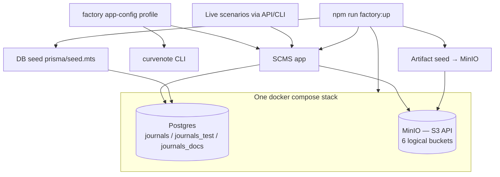

# Reproducible Seeded Environment — Design (Docs Factory · Subsystem 1 + 2)

> **Parent:** [`2026-07-01-docs-factory-vision.md`](./2026-07-01-docs-factory-vision.md)
> (Foundation layer: Subsystem 1 "Reproducible environment" + Subsystem 2
> "Golden scenarios & seeds"). This spec is the foundation the capture harness,
> docs build, and drift/agent layers all depend on.

## 1. Scope

Deliver a **one-command, fully local, deterministic** environment in which SCMS
and the Curvenote CLI run against disposable backing services, seeded with stable
data **and** the storage/CDN artifacts needed for pages to actually render for
screenshots.

In scope: local backing stack (Postgres + MinIO), a `factory` app-config
profile, storage-artifact seeding, golden import/submit/publish scenarios, a
determinism kit, and an orchestrated entrypoint.

Out of scope (deferred to later subsystems): the Playwright capture harness,
docs build/site, drift detection, task generation, agent workers. Also out of
scope (per parent decision A): reproducing GCS Cloud CDN URL-prefix signing.

## 2. Goals & success criteria

- **G1 — One command.** `npm run factory:up` brings the environment from nothing
  to "SCMS serving a seeded, renderable site + a linked CLI" without manual steps.
- **G2 — Deterministic.** Same git ref + same seed ⇒ identical DB rows, identical
  storage keys, and (given the capture harness later) identical screenshots. No
  wall-clock, random IDs, or nondeterministic ordering in seeded output.
- **G3 — Disposable & reproducible.** Tear down and rebuild to a byte-identical
  baseline (`factory:down` / `factory:reset`).
- **G4 — Renderable.** At least one seeded public site renders real content
  (config + at least one published work) from local storage, so a screenshot of a
  published work is possible with no cloud dependency.
- **G5 — Ref-pinnable.** The environment can target an explicit git ref/worktree
  so later drift comparisons (A vs B) are reproducible.

## 3. Architecture

Three data planes, one local stack.

- **Config plane** — a dedicated `factory` app-config environment pointing DB at
  compose Postgres and storage at MinIO.
- **DB plane** — the existing deterministic Prisma seed (reused; add a
  `journals_docs` database).
- **Storage plane** — the new piece: artifacts in MinIO that match seeded works.

### Stack topology (decided)

One compose stack. Reuse the existing single Postgres container (already hosts
`journals` + `journals_test`; add `journals_docs`). Add one **MinIO** service.
Environments are separated by **database name + bucket prefix**, not by separate
stacks — matching how DB isolation already works today.

## 4. Components

### C1 — MinIO in compose + S3 provider endpoint support

**Compose:** add a `minio` service (+ a one-shot `mc` bucket-bootstrap container)
creating the six logical buckets from `knownBucketInfoMap` (`cdn`, `pub`, `prv`,
`tmp`, `hashstore`, `staging`), with `cdn`/`pub` readable for anonymous GET so a
public site renders without signing.

**Required code change (not drop-in):** `S3StorageConfig` and `S3StorageProvider`
hardcode `new S3Client({ region, credentials })` with no endpoint. Add optional
`endpoint` + `forcePathStyle` to:

- `packages/scms-server/src/modules/storage/types.ts` (`S3StorageConfig`)
- `packages/scms-server/src/modules/storage/s3/provider.server.ts` (pass through
  to `S3Client`)
- `.app-config.schema.yml` (`api.storage.s3.endpoint`, `.forcePathStyle`)

This keeps production S3 behaviour unchanged (fields optional) while letting the
`factory` profile target `http://localhost:9000` path-style.

### C2 — `factory` app-config profile

A new app-config environment (e.g. `.app-config.factory.yml`) that sets:

- `api.databaseUrl` → compose Postgres, `journals_docs` DB.
- `api.storage.provider: s3` with `s3.endpoint` → MinIO, path-style, static dev
  creds.
- `knownBucketInfoMap` `cdn`/`pub`/etc. `cdn:` bases → local MinIO-served URLs so
  rendered pages reference reachable assets.
- Secrets (`queueConsumerSecret`, handshake, etc.) → fixed local dev values.

### C3 — DB seed (reuse + extend)

Reuse `prisma/seed.mts` / `seed.utils.mts` as-is (already deterministic and
data-driven). Additions:

- A `journals_docs` target (env-selected DB URL).
- A curated **docs seed dataset** (a `prisma/data/*.json` tuned for
  documentation: small, legible, covers the states we document — draft, in-review,
  published, multi-version).

### C4 — Storage artifact seeding (hybrid — decided)

The seed writes DB rows only; works reference `cdn_key`/`cdn` with no bytes
behind them. Close the gap with a **two-track hybrid**:

- **Track A — pre-baked baseline bundles (fast path).** A committed set of CDN
  artifact bundles (config JSON + rendered content + thumbnails) keyed to the
  docs dataset's `cdn_key`s, uploaded to MinIO by a `factory:seed:storage` step
  right after the DB seed. Powers the bulk of reference/overview screenshots with
  no render/convert pipeline running. Deterministic and offline.
- **Track B — live golden scenarios (fidelity path).** A small number of
  import→submit→publish journeys executed through the running app + CLI so DB and
  storage populate through real code paths. Used for pages that document the
  *act* (upload wizard, submission flow, publish confirmation) and as the fidelity
  anchor that keeps Track A bundles honest.

Rationale: Track A keeps the inner loop fast and avoids standing up the full
render/convert worker set for every screenshot; Track B preserves fidelity where
it matters and doubles as behaviour coverage for drift detection later.

### C5 — Determinism kit

Consolidate determinism primitives (some already exist in `seed.utils.mts`):

- **Fixed identities & dates:** reuse fixed user IDs and `startDate` 2023-02-01.
- **Seeded RNG:** reuse mulberry32-keyed-by-id; extend to any new generators.
- **Deterministic IDs for scenarios:** Track B needs an injectable ID/clock so
  live-run artifacts land at stable keys (this is new work — real flows currently
  mint `uuidv7`/wall-clock values).
- **Stable ordering** in any listing the docs screenshot.

### C6 — Orchestrated entrypoint

`npm run factory:up` sequences: compose up (Postgres + MinIO, `--wait`) →
migrate (`journals_docs`) → DB seed → storage artifact seed (Track A) → build/link
CLI → start SCMS on the `factory` profile. Companion scripts: `factory:down`,
`factory:reset` (byte-identical rebuild), `factory:scenario <name>` (Track B).

## 5. Golden scenarios (Subsystem 2)

Each scenario is a named, reusable, deterministic sequence callable by humans and
(later) the capture harness. Initial set aligned to the user's priorities:

| Scenario | Track | Documents |
| --- | --- | --- |
| `baseline` | A | Dashboard, My Works listing, work detail, published site render |
| `import-article` | B | CLI/UI import of an article into a work |
| `submit-article` | B | Submitting a work to a site collection |
| `publish-article` | B | Publishing a submission; published state |

Scenario definitions live in-repo (e.g. `docs-factory/scenarios/`) with a small
declarative shape (steps + expected end state) so they can be replayed and later
diffed.

## 6. Interfaces & boundaries

- **Config is the only coupling point** between the factory and SCMS — the app is
  unchanged except for the optional S3 `endpoint` fields.
- **Track A artifacts** have a documented layout mirroring production CDN bucket
  structure so bundles are portable if we later capture against real GCS.
- **Scenario runner** depends on the CLI + v1 API only — no direct DB writes — so
  Track B stays representative.

## 7. Open questions

1. **Render/convert workers for Track B:** do `publish-article` end states need
   the real converter/render services running locally, or can Track B stop at the
   pre-render state and reuse a Track A bundle for the rendered view?
2. **Artifact bundle provenance:** generate Track A bundles once from a real run
   and commit them, or script their regeneration? (Leaning: generate-then-commit,
   with a documented regen path.)
3. **Bundle storage location & size:** in-repo vs a pulled artifact archive, given
   binary/thumbnail weight.
4. **CLI auth locally:** how the CLI authenticates against the factory SCMS for
   Track B (fixed dev token vs local auth provider).

## 8. Verification / "done"

- `factory:up` from a clean machine yields SCMS serving a seeded site with at
  least one published work rendering from MinIO (G1, G4).
- `factory:reset` reproduces byte-identical DB + storage baselines (G2, G3).
- `factory:scenario submit-article` completes through the real API/CLI against
  the running app (Track B smoke).
- Production storage behaviour unchanged when `s3.endpoint` is unset.

## 9. Next step

On approval, invoke the writing-plans skill to turn this into a phased
implementation plan (suggested phases: C1 MinIO+provider → C2 config → C3/C4 seed
+ artifacts → C6 entrypoint → C5 scenario determinism → Track B scenarios).
