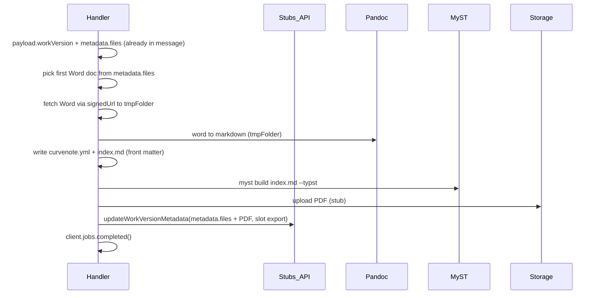

# SCMS Converter: Word-to-PDF conversion

Consolidated plan for implementing the converter handler: payload contains full work version at invocation; convert first Word doc to PDF via **pandoc-myst** (Word → Pandoc → Markdown, then MyST with Typst → PDF); upload PDF and update work version metadata (stubs until APIs exist). The generated PDF is added to `metadata.files` under the slot **"export"**.

---

## 1. Payload specification

The message payload (decoded from Pub/Sub `message.data`) is a JSON object.

### Required keys

- **`workVersion`** (required) — Object matching the WorkVersion Prisma model (see below). All data comes from the message; no separate fetch.
- **`target`** (required) — For now only `"pdf"` is supported.

Optional: `taskId` for logging.

### WorkVersion shape

From [prisma/schema/work.prisma](../../prisma/schema/work.prisma) (WorkVersion model):

| Field | Type | Notes |
|-------|------|--------|
| id | string | |
| work_id | string | |
| date_created | string | |
| date_modified | string | |
| draft | boolean | |
| cdn | string? | |
| cdn_key | string? | |
| title | string | |
| description | string? | |
| authors | string[] | |
| author_details | Json[] | |
| date | string? | |
| doi | string? | |
| canonical | boolean? | |
| **metadata** | **Json?** | WorkVersionMetadata & FileMetadataSection (see below) |
| occ | number | |

Relations may be omitted when serializing for the converter.

### The `metadata` field

`workVersion.metadata` is a JSON object with:

- **WorkVersionMetadata** ([packages/scms-server/src/backend/metadata.ts](../../packages/scms-server/src/backend/metadata.ts)): `{ version: 1; checks?: { enabled: string[] }; [key: string]: any }`.
- **FileMetadataSection** ([packages/scms-core/src/backend/uploads/schema.ts](../../packages/scms-core/src/backend/uploads/schema.ts)): `{ files: Record<string, FileMetadataSectionItem> }`. Each file has `name`, `size`, `type`, `path`, `md5`, `uploadDate`, `slot`, and optionally `label`, `order`, `signedUrl`.

We expect `metadata.version === 1` and `metadata.files` as an object. File entries may include `signedUrl` for download.

### Validation and defensive access

- **Validate partially**: Require `payload.workVersion` (non-null object) and `payload.target === 'pdf'`. Require `workVersion.id`, `workVersion.work_id`, `workVersion.title`, `workVersion.authors`. If the pipeline needs `metadata.files`, require `workVersion.metadata` to be a non-null object.
- **Defensive access**: Before using `metadata.files`, check `metadata` and `metadata.files` are objects. Do not assume every file has `signedUrl`; fail or skip gracefully when the chosen Word doc has no `signedUrl`.

### PDF slot in metadata.files

When adding the generated PDF to `metadata.files`, use the fixed slot name **`"export"`**.

---

## 2. Conversion type (attribute)

Message **attributes** must include:

- **`conversionType`** — The default and only supported value is **`pandoc-myst`**. Validated at handler start; reject with a clear error if missing or not `pandoc-myst`. Future values could add other pipelines (e.g. `pandoc-direct`: Word → PDF via Pandoc only).

## 3. Architecture (high level)



No Works API call to **get** work version; the publisher supplies the full work version in the payload.

---

## 4. Context and references

- **Handler**: [src/service.ts](src/service.ts) — POST uses `withPubSubHandler`; receives `(client, attributes, payload, tmpFolder, res)`.
- **Attributes**: `jobUrl`, `statusUrl`, `handshake`, **`conversionType`** (must be `pandoc-myst`). Derive Works API base URL from `jobUrl` or `statusUrl` (e.g. origin + `/v1`) for the **update** call only.
- **PMC FTP reference**: [extensions/hhmi-os-ext/packages/pmc-ftp-service](../../extensions/hhmi-os-ext/packages/pmc-ftp-service) — same `withPubSubHandler` pattern; streaming download from signed URLs.

---

## 5. Implementation steps

### 5.1 Payload, attributes, and API helpers

- **Payload type**: `ConverterPayload = { taskId?: string; target: 'pdf'; workVersion: WorkVersionPayload }`. Use key **`workVersion`**. Assign `const workVersion = payload.workVersion` in the handler.
- **Attributes**: Require `attributes.conversionType === 'pandoc-myst'`; throw with a clear message if missing or unsupported.
- **WorkVersionPayload**: Align with WorkVersion model fields; `metadata` typed as object with `version` and `files` (minimal or reuse from scms-core).
- **getWorksApiBase(attributes)**: Parse `jobUrl` or `statusUrl` to return v1 base URL. Used only for update (and upload stub if API-based).

### 5.2 Pick Word doc and download

- In `metadata.files`, find the first entry where `type` is `application/vnd.openxmlformats-officedocument.wordprocessingml.document` or `name`/path ends with `.docx`.
- If none: throw a clear error (e.g. "No Word document found in metadata.files").
- Download via `signedUrl` (or fallback from path + CDN if defined). Stream to `tmpFolder/input.docx`. Reuse PMC FTP pattern: `fetch(signedUrl)` then stream to disk.

### 5.3 Pandoc: Word → Markdown

- For **pandoc-myst**: Run `pandoc input.docx -o index.md` from `tmpFolder` with `child_process` (`execFile`/`spawn`). Output: `tmpFolder/index.md`. Handle Pandoc-not-found and bad docx.

### 5.4 Curvenote/MyST project

- **Target folder**: `tmpFolder` as project root.
- **curvenote.yml**: Ship a minimal template in the converter (e.g. [src/templates/curvenote.yml](src/templates/curvenote.yml)): version, project (id, title, description), site. Augment: `project.id` = new UUID; `project.title` = `workVersion.title`; authors from `workVersion.authors` (and optionally `author_details`).
- **index.md**: Pandoc already wrote the body. Prepend front matter with title and single PDF export (MyST): `format: typst`, `template: lapreprint-typst`, `output: exports/document.pdf`. See [MyST PDF export](https://mystmd.org/guide/creating-pdf-documents#how-to-export-to-pdf).

### 5.5 MyST build

- Assume Curvenote/MyST CLI on PATH. Run e.g. `myst build index.md --typst` from `tmpFolder`. Expect output at `exports/document.pdf`. Add `myst init` only if build requires it.

### 5.6 Upload PDF to storage (stub)

- **uploadPdfToStorage(localPdfPath, cdn, cdnKey, handshake, baseUrl)**: Stub: log and return placeholder (e.g. `path: ${cdnKey}/export/document.pdf`). Real implementation: upload API or GCS with service account under version `cdn`/`cdn_key`.

### 5.7 Augment metadata.files and update work version (stub)

- Clone `workVersion.metadata`, add one entry to `metadata.files` for the PDF with **slot `"export"`** (same shape as FileMetadataSectionItem). Use path/size/type from built PDF and from `uploadPdfToStorage` return value.
- **updateWorkVersionMetadata(workId, workVersionId, metadata, handshake, baseUrl)**: Stub: log and return. Real implementation: **PATCH** Works API (e.g. `PATCH ${baseUrl}/works/${workId}/versions/${workVersionId}`) with body `{ metadata }` and `Authorization: Bearer ${handshake}`. We **do** need this Works API endpoint to persist updated metadata after conversion.

### 5.8 Success path and dependencies

- On success: `client.submissions.putStatus(successState, userId, res)` and `client.jobs.completed(res, '...', { taskId, workVersionId: workVersion.id, ... })`. On failure: throw so wrapper cleans up and calls `client.jobs.failed`.
- Dependencies: Use Node `crypto.randomUUID()` if needed, `child_process`, `fs/promises`, `fetch`. Add `@curvenote/scms-core` only if needed for file types; otherwise minimal local types.

---

## 6. File layout (suggested)

| File | Purpose |
|------|---------|
| [src/service.ts](src/service.ts) | Handler: validate attributes (conversionType pandoc-myst), payload (workVersion + target), pick Word → download → pandoc (Word → Markdown) → write curvenote.yml + index.md front matter → myst build --typst → uploadPdf (stub) → updateMetadata (stub) → completed. |
| src/worksApi.ts (or stubs.ts) | `updateWorkVersionMetadata`, `uploadPdfToStorage` only (no getWorkVersion). |
| src/convert.ts (or wordToPdf.ts) | Pure steps for pandoc-myst: pickWordFile, downloadFile, runPandoc, writeProjectFiles, runMystBuild. |
| src/templates/curvenote.yml | Minimal template to copy and augment. |

---

## 7. Open points (for later)

- Exact MyST/Curvenote CLI command and flags (e.g. `myst build index.md --typst`).
- How to write `author_details` into curvenote.yml or frontmatter.
- **Required**: Works API endpoint to **update** work version metadata (PATCH with `{ metadata }`) so the converter can persist augmented `metadata.files` after PDF upload.
- Real upload path: resumable upload API vs direct GCS write with service account.
- Future conversion types (e.g. `pandoc-direct`: Word → PDF via Pandoc only) if needed.

---

## 8. Test payload (post-message.sh)

[scripts/post-message.sh](scripts/post-message.sh) sends a payload with `workVersion` and one Word-doc-style entry in `metadata.files`. Example file entry shape:

```json
"<path>": {
  "md5": "...",
  "name": "Paper.docx",
  "path": "<path>",
  "size": 12078,
  "slot": "pmc/manuscript",
  "type": "application/vnd.openxmlformats-officedocument.wordprocessingml.document",
  "label": "Paper",
  "uploadDate": "2025-07-07T16:10:41.212Z"
}
```

Add `signedUrl` for a real download URL when testing conversion end-to-end. Include message attribute **`conversionType`: `"pandoc-myst"`** when posting (see [scripts/post-message.sh](scripts/post-message.sh) attributes).
