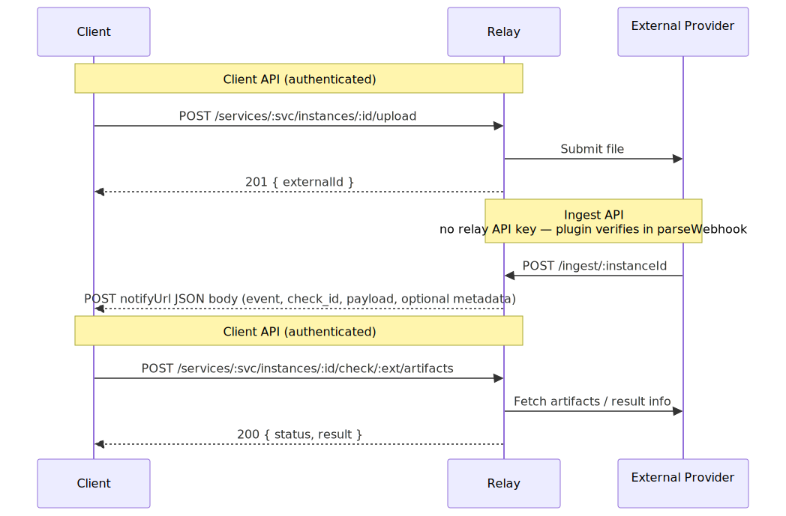
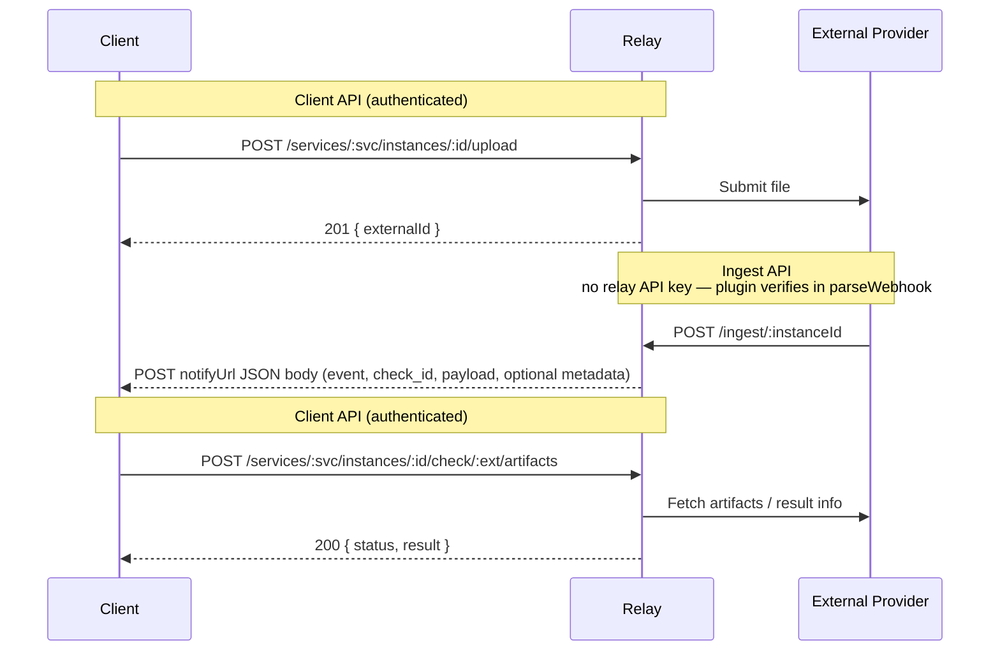

# Checks Relay API Reference

Base URL: `/api/v1`

For **service plugin** implementers (`ServicePlugin`, webhooks, `upload` payload), see [plugin-interface.md](plugin-interface.md).

## Interfaces

The relay sits between two callers. The endpoints below are grouped by which caller uses them.



<details>
<summary>Diagram source</summary>



</details>

### Ingest API — no relay API key; verification delegated to the plugin

| Method | Path                                   | Description                                         |
| ------ | -------------------------------------- | --------------------------------------------------- |
| `POST` | `/api/v1/ingest/:instanceId`           | Provider webhook ingestion                          |
| `POST` | `/api/v1/ingest/:instanceId/:uniqueId` | Provider webhook ingestion (with optional dedup id) |

The `:instanceId` identifies which **service instance** in app-config to use (credentials, signing secret). The optional `:uniqueId` segment is ignored by the relay but allows providers or configuration to include a unique per-webhook identifier in the URL for traceability.

These endpoints have no relay-level authentication (no API key required). The relay calls the plugin’s **`verifyWebhook`** first with **`WebhookVerifyRequest`** (raw body + headers) and **`IngestInstanceConfig`** — for example HMAC-SHA256 for signed provider webhooks. Only after that succeeds does the relay **`JSON.parse`** the body and call **`parseWebhook`**.

The ingest route returns **`401`** when **`verifyWebhook`** throws **`WebhookSignatureInvalidError`**, **`400`** for invalid JSON after verification, and **`500`** for other handler failures.

After verification, the relay extracts routing metadata (`clientId`, `notifyUrl`) from the provider payload and forwards a notify envelope to the client's `notifyUrl`.

### Client API — authenticated with `Authorization: Bearer <API_KEY>`

#### Discovery

| Method | Path                            | Description             |
| ------ | ------------------------------- | ----------------------- |
| `GET`  | `/api/v1`                       | Health / liveness check |
| `GET`  | `/api/v1/services`              | List available services |
| `GET`  | `/api/v1/services/:serviceName` | Service detail          |

Client API routes (except discovery) are under **`/api/v1/services/:serviceName/instances/:instanceId/`**.

#### Setup & Configuration

| Method | Path                                                            | Description                              |
| ------ | --------------------------------------------------------------- | ---------------------------------------- |
| `POST` | `/api/v1/services/:serviceName/instances/:instanceId/configure` | Register webhooks for a service instance |
| `POST` | `/api/v1/services/:serviceName/instances/:instanceId/terms`     | Get provider EULA / terms                |
| `POST` | `/api/v1/services/:serviceName/instances/:instanceId/status`    | Service-level status & capabilities      |

#### Check Lifecycle

| Method | Path                                                                                  | Description                                                     |
| ------ | ------------------------------------------------------------------------------------- | --------------------------------------------------------------- |
| `POST` | `/api/v1/services/:serviceName/instances/:instanceId/upload`                          | Upload manuscript(s) and start a check at the provider          |
| `POST` | `/api/v1/services/:serviceName/instances/:instanceId/check/:externalId/status`        | Poll check status                                               |
| `POST` | `/api/v1/services/:serviceName/instances/:instanceId/check/:externalId/artifacts`     | Fetch check artifacts / structured result info (plugin-defined) |
| `POST` | `/api/v1/services/:serviceName/instances/:instanceId/check/:externalId/trigger-stage` | Trigger a named processing phase (plugin-defined)               |

#### Report (nested under `check/:externalId/report/…`)

| Method | Path                                                                                            | Description                                                |
| ------ | ----------------------------------------------------------------------------------------------- | ---------------------------------------------------------- |
| `POST` | `/api/v1/services/:serviceName/instances/:instanceId/check/:externalId/report/start-generation` | Ask the provider to start report generation                |
| `POST` | `/api/v1/services/:serviceName/instances/:instanceId/check/:externalId/report/fetch`            | Download report payload (JSON or binary PDF)               |
| `POST` | `/api/v1/services/:serviceName/instances/:instanceId/check/:externalId/report/viewer-url`       | Get embeddable viewer URL (when supported)                 |
| `POST` | `/api/v1/services/:serviceName/instances/:instanceId/check/:externalId/report/pdf/start`        | Start similarity PDF generation at the provider (optional) |

---

## Authentication

All `/api/v1/services/*` endpoints require a **relay API key** — this is the key that secures the relay itself, not credentials for any external provider. Provider credentials are configured server-side per **service instance** (app-config `instances`) and never sent by the client.

```
Authorization: Bearer <RELAY_API_KEY>
```

The `/api/v1` health endpoint and `/api/v1/ingest/*` webhook endpoints are unauthenticated.

The relay API key is set via the `apiKey` field in the relay's app-config. See [config.md](config.md) for all configuration options.

---

## Discovery

### `GET /api/v1`

Health / liveness check.

**Response** `200`

```json
{ "status": "ok", "service": "checks-relay", "timestamp": "2026-04-10T12:00:00.000Z" }
```

### `GET /api/v1/services`

List available services.

**Response** `200` — array of:

| Field         | Type   | Description               |
| ------------- | ------ | ------------------------- |
| `name`        | string | Service identifier        |
| `title`       | string | Display name              |
| `description` | string | Short description         |
| `version`     | string | Plugin version            |
| `logo`        | string | Logo URL                  |
| `metadata`    | object | Service-specific metadata |

### `GET /api/v1/services/:serviceName`

Service detail. Same shape as a list item.

**Response** `200` — single service object  
**Response** `404` — `{ "error": "<message>" }`

---

## Service Operations

All `POST` bodies are JSON. The **service instance** is selected by the URL path (`instances/:instanceId`), not the body. Optional top-level **`credentials`** is split off before the plugin runs (same as before).

### `POST /api/v1/services/:serviceName/instances/:instanceId/configure`

Register webhooks and configure the provider for this service instance.

**Body**

Optional fields only (e.g. nested `credentials` for testing); no required instance field in the body.

**Response** `200`

```json
{ "status": "completed", "result": { "<serviceSpecific>": "<value>" } }
```

### `POST /api/v1/services/:serviceName/instances/:instanceId/terms`

Retrieve EULA / terms of service for the provider.

**Body**

Optional; plugin-specific fields only.

**Response** `200` — terms payload (service-specific)

### `POST /api/v1/services/:serviceName/instances/:instanceId/status`

Service-level status and capabilities (not check-specific).

**Body**

Optional; plugin-specific fields only.

**Response** `200` — `{ "manifest": <serviceManifest>, <additional service status fields> }`

---

## Upload (manuscript)

### `POST /api/v1/services/:serviceName/instances/:instanceId/upload`

Upload manuscript file(s) to the provider and create a submission. The relay forwards to the plugin and returns when the provider accepts the upload (async work may continue; use notifies and check-scoped routes).

**Body**

| Field       | Type   | Required | Description                                      |
| ----------- | ------ | -------- | ------------------------------------------------ |
| `clientId`  | string | yes      | Your idempotency key (e.g. check run id)         |
| `files`     | array  | yes      | `[{ "url": "<fileUrl>", "filename": "<name>" }]` |
| `notifyUrl` | string | yes      | Webhook URL for status callbacks                 |
| `metadata`  | object | no       | Service-specific options                         |

**Response** `201`

```json
{
  "status": "submitted",
  "message": "<providerMessage>",
  "result": {
    "externalId": "abc-123-def",
    "<optionalProviderFields>": "<value>"
  }
}
```

Top-level **`status`** is a coarse lifecycle value from the plugin (`submitted`, `processing`, `completed`, `failed`, or `error`) — not an HTTP-style `201 Created` alias. The `externalId` inside **`result`** is the provider-assigned identifier; use it in all subsequent `…/instances/:instanceId/check/:externalId/…` calls.

**Response** `400` — validation error  
**Response** `502` — provider error

---

## Check Operations

All check-scoped endpoints use paths under `/api/v1/services/:serviceName/instances/:instanceId/check/:externalId/` (e.g. `status`, `artifacts`, `trigger-stage`, or the `report/…` subtree). Bodies carry only plugin-specific fields (and optional `credentials`).

### `POST /api/v1/services/:serviceName/instances/:instanceId/check/:externalId/status`

Poll current check status from the provider.

**Body** — `{}` or plugin-specific fields

**Response** `200`

```json
{ "status": "processing" | "completed" | "error", "result": <object> | null }
```

### `POST /api/v1/services/:serviceName/instances/:instanceId/check/:externalId/artifacts`

Fetch structured **artifacts** / result info for the check (plugin-defined; e.g. scores, matched sources, intermediate provider state).

**Body** — `{}` or plugin-specific fields

**Response** `200` — `{ "status": "<string>", "result": <object> }`

### `POST /api/v1/services/:serviceName/instances/:instanceId/check/:externalId/trigger-stage`

Ask the plugin to start or advance a **named processing phase** for this check. Intended for multi-stage flows where some stages are not started solely by provider ingest webhooks. The set of valid **`phase`** values is service-specific.

**Body** — `{ "phase": "<phase>", <optional service-specific fields> }`

**Response** `200` — `{ "status": "<string>", "message"?: "<string>", "result": <object> | null }`  
**Response** `400` — missing or empty **`phase`**

### `POST /api/v1/services/:serviceName/instances/:instanceId/check/:externalId/report/start-generation`

Request the provider to **start** report generation for this check.

**Body** — `{}` or plugin-specific fields

**Response** `200` — `{ "status": "<string>", "result": <object> }`

### `POST /api/v1/services/:serviceName/instances/:instanceId/check/:externalId/report/fetch`

**Fetch** the report from the provider. May return JSON or binary (PDF).

**Body** — `{}` or service-specific fields (e.g. `pdf_id`)

**Response** `200` — JSON or binary (`Content-Type: application/pdf`)

### `POST /api/v1/services/:serviceName/instances/:instanceId/check/:externalId/report/viewer-url`

Get an embeddable viewer URL when the service supports it (may be valid at different lifecycle points; semantics are plugin-defined).

**Body** — `{}` or plugin-specific fields

**Response** `200` — `{ "status": "<string>", "result": { "viewer_url": "<url>" } }`

### `POST /api/v1/services/:serviceName/instances/:instanceId/check/:externalId/report/pdf/start`

Start **similarity PDF** generation at the provider (optional; not all plugins implement `startReportPdf` on **`ServicePlugin`**).

**Body** — `{}` or plugin-specific fields (e.g. `locale`)

**Response** `200` — `{ "status": "<string>", "result": <object> }`

---

## Notify Webhooks

The relay sends `POST` requests to the `notifyUrl` you provided in `POST /api/v1/services/:serviceName/instances/:instanceId/upload`. Each request body is a JSON envelope:

```json
{
  "event": "UPLOAD_ACCEPTED",
  "check_id": "abc-123-def",
  "client_id": "your-client-id",
  "service_name": "external-service",
  "occurred_at": "2026-04-10T12:00:00.000Z",
  "payload": {},
  "metadata": {}
}
```

`payload` holds event-specific fields; `metadata` is optional and may be omitted or empty.

### Envelope Fields

| Field          | Type    | Description                                                                                  |
| -------------- | ------- | -------------------------------------------------------------------------------------------- |
| `event`        | string  | Event name (see table below)                                                                 |
| `check_id`     | string  | Provider-assigned identifier (`externalId`)                                                  |
| `client_id`    | string  | The `clientId` you sent in `POST /api/v1/services/:serviceName/instances/:instanceId/upload` |
| `service_name` | string  | Service name                                                                                 |
| `occurred_at`  | string  | ISO-8601 timestamp                                                                           |
| `payload`      | object  | Event-specific data                                                                          |
| `metadata`     | object? | Optional service-specific extras                                                             |

### Events

| Event                        | Payload                                                          | Description                                                               |
| ---------------------------- | ---------------------------------------------------------------- | ------------------------------------------------------------------------- |
| `UPLOAD_PENDING`             | `{ "upload_status": "PENDING" }`                                 | Submission still ingesting / in progress (coarse)                         |
| `UPLOAD_ACCEPTED`            | `{ "upload_status": "ACCEPTED" }`                                | Provider accepted the manuscript (e.g. submission-complete without error) |
| `UPLOAD_COMPLETE`            | `{ "upload_status": "COMPLETE" }`                                | Provider signaled completion for this status update (generic fallback)    |
| `UPLOAD_FAILED`              | `{ "upload_status": "ERROR", "error_code?", "error_message?" }`  | Submission / ingest failed (upload lane, not report phases)               |
| `PROCESSING_PHASE_STARTED`   | `{ "started": true }`                                              | Processing phase began (semantic detail via event name / extension state) |
| `PROCESSING_PHASE_COMPLETE`  | `{ "completed": true, "similarity_report?", "provider_payload?" }` | Phase finished                                                            |
| `PROCESSING_PHASE_FAILED`    | `{ "failed": true, "error_code?", "error_message?" }`             | Phase failed                                                              |
| `REPORT_GENERATION_STARTED`  | `{ "status": "PROCESSING", "report?" }`                          | Report generation began                                                   |
| `REPORT_GENERATION_COMPLETE` | `{ "status": "SUCCESS", "report?" }`                             | Report ready                                                              |
| `REPORT_GENERATION_FAILED`   | `{ "status": "FAILED", "error_message?" }`                       | Report generation failed                                                  |

The `report` object (when present):

| Field            | Type    | Description                |
| ---------------- | ------- | -------------------------- |
| `report_id`      | string? | Provider report identifier |
| `report_url`     | string? | URL to view the report     |
| `report_pdf_url` | string? | Direct URL to PDF resource |
| `mime_type`      | string? | e.g. `application/pdf`     |

---

## Error Responses

All error responses use:

```json
{ "error": "Human-readable message" }
```

or for operation errors:

```json
{ "status": "error", "message": "<message>", "result": null }
```

| Status | Meaning                                       |
| ------ | --------------------------------------------- |
| `400`  | Validation error (missing fields, bad format) |
| `401`  | Missing or invalid API key                    |
| `404`  | Unknown service or service instance           |
| `500`  | Internal error                                |
| `502`  | Provider returned an error                    |
