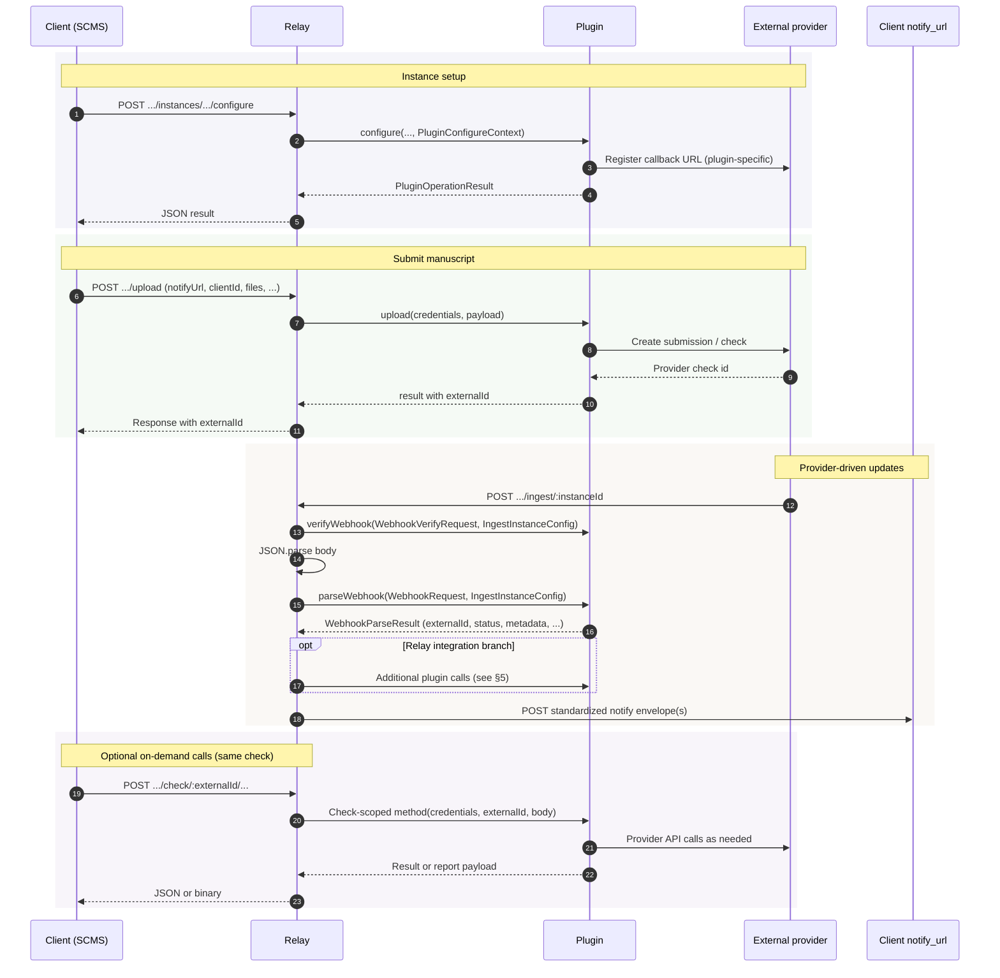

# Tutorial: plugin lifecycle and how a real integration uses the surface

This guide walks through **how a service plugin fits into the relay**, how **stages** line up from the client’s perspective, and how **one production-style integration in this repository** achieves its goals by **implementing only the parts of `ServicePlugin` and the HTTP API that it needs** — not every optional hook.

It is written so you can follow the architecture **without** relying on any particular vendor’s product name or HTTP contract. For type-level detail, see [plugin-interface.md](plugin-interface.md); for REST and notify shapes, see [api-reference.md](api-reference.md).

---

## 1. Three actors

| Actor | Role |
|-------|------|
| **Client (SCMS)** | Calls relay REST routes with the relay API key; supplies `notifyUrl` and a client idempotency key on upload; receives **notify webhooks** (standard envelopes). |
| **Relay** | Authenticates client calls, resolves **service instance** config, builds `credentials`, invokes the right **plugin** methods, and POSTs to `notifyUrl`. For some integrations it also runs **extra orchestration** after ingest (see §5). |
| **Plugin** | A single object implementing `ServicePlugin`: talks to the **external provider** on behalf of the relay and normalizes outcomes. |

The **external provider** is outside the relay: manuscript storage, analysis, reports, and **callbacks into** `POST /api/v1/ingest/:instanceId`.

---

## 2. Lifecycle stages (client view)

Think of a check moving through **coarse stages**. Exact timing depends on the provider; the relay standardizes what the client sees via **notify `event` names** (see `@curvenote/check-relay-types`).

1. **Instance readiness** — Client (or ops) confirms the service instance is configured: capabilities, legal/terms if applicable, webhook endpoint registered at the provider so ingest URLs work.
2. **Submission** — Client uploads manuscript(s); relay returns an **`externalId`** (provider-side check id) the client keeps for all later check-scoped calls.
3. **Ingest / async updates** — Provider pushes progress to the relay; relay validates via **`parseWebhook`**, may run integration-specific follow-up, then emits **`UPLOAD_*`**, **`PROCESSING_PHASE_*`**, and **`REPORT_GENERATION_*`** notifies as appropriate.
4. **On-demand operations** — Client may call check-scoped routes (status, artifacts, report helpers, optional **phase triggers**) any time the integration supports them.

Stages 3 and 4 can **overlap**: notifies can arrive while the client is already polling or starting report actions.

---

## 3. Full plugin surface vs what you must implement

`ServicePlugin` defines a **menu** of capabilities. A real plugin **picks** from that menu:

- **Required for a useful integration:** `name`, `manifest`, `upload`, `parseWebhook`, plus whatever your routes and docs promise (often `configure`, `getInstanceStatus`, and several check-scoped methods).
- **Often required for UX:** `getTerms`, `getCheckStatus`, report-related methods if clients need PDFs, viewer links, or structured artifacts.
- **Optional on the type:** e.g. `startReportPdf` — if omitted, the corresponding relay route returns a clear error.

The bundled **echo** plugin is deliberately minimal: it proves wiring and simulates a few steps without a real provider. By contrast, the **reference document-similarity plugin** in this repo (the production-style package under `packages/service-plugin-*` for similarity checking) implements **most** of the check-scoped surface because clients need reports, artifacts, and phased processing — but it still does **not** require the client to use every HTTP route.

---

## 4. Sequence: happy path (conceptual)

The diagram below is **schematic**. Dashed steps happen only for integrations where the relay includes **ingest orchestration** (see §5). Arrow labels are logical, not literal HTTP paths or headers.

---

## 5. When the relay does more than `parseWebhook`

For **most** plugins, ingest is: **`parseWebhook`** → map to notify events → **`postNotify`**.

For **one** bundled similarity-style integration, the relay’s ingest handler also:

- Inspects **normalized** information from the webhook body (after the plugin has parsed and verified it).
- On certain **lifecycle transitions**, calls **`startReportGeneration`** on the plugin so analysis begins without an extra client round-trip.
- May perform **follow-up HTTP requests** using the instance’s configured base URL and API key to obtain report identifiers, then emit **`REPORT_GENERATION_*`** notifies with structured **`report`** hints.

That behavior is **not** part of the generic `ServicePlugin` contract — it is **relay + plugin name-specific** orchestration. If you add a new plugin, you should assume **only** `parseWebhook` runs on ingest unless you deliberately extend `ingest.ts` (or move orchestration into the plugin behind a stable internal API).

**Takeaway:** the reference similarity plugin still **does not use “every feature”** of the relay; it **relies on** this extra ingest logic for part of its lifecycle. Another plugin might do everything inside `parseWebhook` and provider callbacks with no relay branches.

---

## 6. Phases and `triggerProcessingStage`

Some workflows are easier to drive with **named phases** than with a single giant state machine. The relay exposes:

`POST .../check/:externalId/trigger-stage` with a JSON body containing **`phase`** (non-empty string). The plugin interprets phase names **by convention**.

The reference similarity plugin maps a **small, fixed set** of phase strings to existing operations (for example: one phase starts **report generation**; another starts **optional printable report creation** — the same operations also reachable via dedicated report routes). Plugins that do not need phases can return an error for unknown `phase` values or omit meaningful implementation.

Echo uses different phase names to demonstrate the same mechanism without a real provider.

---

## 7. Notify events (standardized client contract)

Regardless of provider quirks, the client should implement handlers for the **shared** `event` names, for example:

- **`UPLOAD_*`** — coarse submission / ingest lane.
- **`PROCESSING_PHASE_*`** — plugin-defined phases (e.g. analysis started, completed, failed).
- **`REPORT_GENERATION_*`** — report / printable output lifecycle.

The plugin’s `parseWebhook` return value supplies **`externalId`**, **`clientId`**, **`notifyUrl`** (when embedded in provider metadata) so the relay can route notifies. If **`notifyUrl`** is missing, the relay accepts the ingest request but does not POST to the client.

---

## 8. Summary table: “full API” vs reference similarity plugin

| Area | In `ServicePlugin` / relay? | Reference similarity plugin |
|------|-----------------------------|-----------------------------|
| Discovery (`manifest` on GET services) | Yes | Exposes manifest |
| Instance `status` / `configure` / `terms` | Yes | Implemented |
| `upload` | Yes | Implemented |
| Ingest `parseWebhook` | Yes | Implemented (signing / normalization) |
| Check-scoped: status, artifacts, report routes | Yes | Implemented where clients need them |
| Optional `startReportPdf` | Optional on interface | Implemented |
| `triggerProcessingStage` | Yes | Implements a **subset** of phase names |
| Extra ingest orchestration in relay | Per-integration | Used for this integration only |

---

## 9. Further reading

- [plugin-interface.md](plugin-interface.md) — `ServicePlugin` method reference and types.
- [api-reference.md](api-reference.md) — REST paths and notify payloads.
- [config.md](config.md) — service instances, credentials, ingest URL segments.

When you implement a new provider, **start from the client journeys** you need to support, then implement **only** the plugin methods and routes those journeys require — and extend ingest only if you truly need relay-side orchestration beyond `parseWebhook`.
