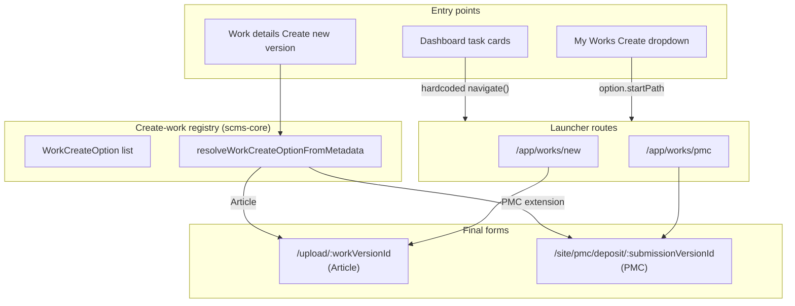
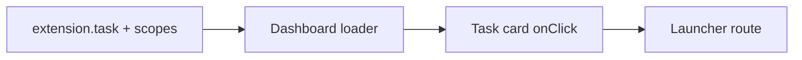
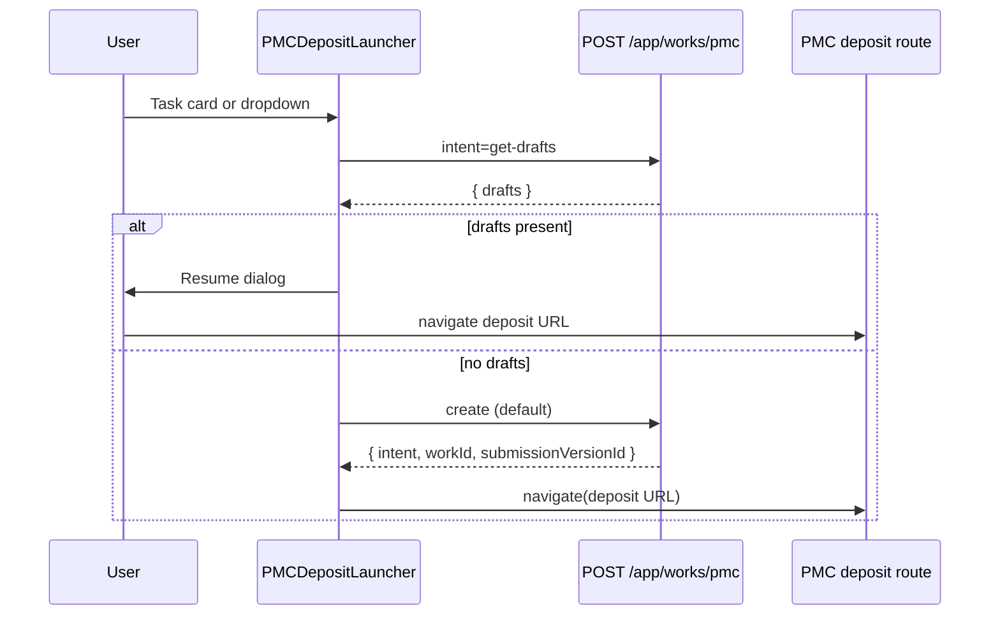
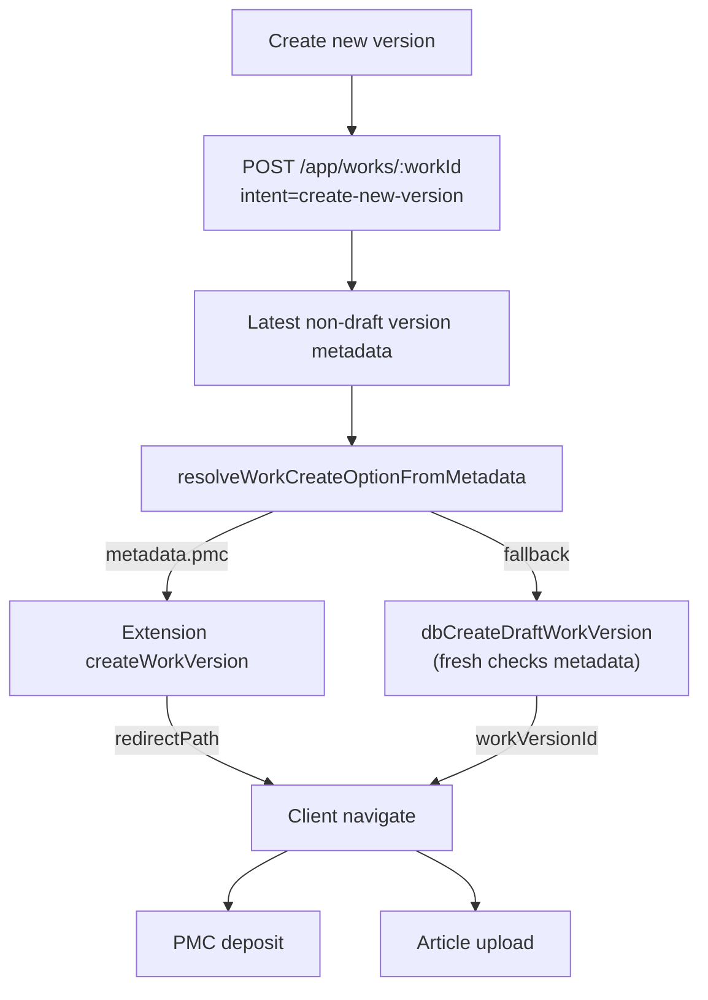

# Create-work flows — architecture and routing

This document describes how users start new works and new versions in SCMS when multiple **create flows** exist (Article upload, PMC Deposit, and future extension flows). It complements [upload-work-and-new-version-flows.md](./upload-work-and-new-version-flows.md), which focuses on the original Article-only paths.

**Contents**

- [Mental model](#mental-model)
- [Create-work registry](#create-work-registry)
- [Extension config flags](#extension-config-flags)
- [Entry points](#entry-points)
- [Launcher routes](#launcher-routes)
- [Create new version (work details)](#create-new-version-work-details)
- [Metadata resolution](#metadata-resolution)
- [Work layout guards](#work-layout-guards)
- [Fetcher vs redirect](#fetcher-vs-redirect)
- [Code reference](#code-reference)
- [Known gaps](#known-gaps)

---

## Mental model

There is **no central router** that maps every button to a form. Instead:

1. **Entry UI** (dashboard task card, My Works dropdown, work details button) sends the user to a **launcher route** or POSTs an action.
2. **Launchers** check for existing drafts, optionally show a resume dialog, create a draft work/version, then **navigate client-side** to the correct form.
3. **Create-new-version** on work details **infers** the flow from the latest **non-draft** version metadata (extensions win; Article is the fallback).



| Layer | Responsibility |
|-------|----------------|
| **Dashboard** | Which task **cards** to show (`task: true` + scopes) |
| **Task card component** | Where to **start** (hardcoded launcher URL in the component) |
| **My Works dropdown** | Which **create options** to offer (`routes: true` + registry) |
| **Launcher** | Draft check → create → navigate to form |
| **Work details action** | Metadata-based flow for **new version** on an existing work |

---

## Create-work registry

Registered in `@curvenote/scms-core` alongside other extension registries (tasks, checks, routes, workflows).

### `WorkCreateOption`

Declarative description of a create flow — **not** a work “type” enum:

| Field | Purpose |
|-------|---------|
| `id` | Stable option id (e.g. `article`, `pmc-deposit`) |
| `label` / `description` / `icon` | My Works dropdown presentation |
| `metadataKey` | Top-level `workVersion.metadata` key that identifies this flow on **existing** works |
| `startPath` | App-absolute path that starts creation (e.g. `/app/works/new`) |
| `mode` | `standalone` \| `composite` (reserved for future composite forms) |
| `extensionId` | Set when filtered from an extension |

### Built-in Article option

Always available when upload scope is present:

- `id`: `article`
- `metadataKey`: `frontmatter.myst` (descriptive; **not used for resolution** — see [Metadata resolution](#metadata-resolution))
- `startPath`: `/app/works/new`

### Extension options

Extensions implement `getWorkCreateOptions()` on `ClientExtension`. Example: PMC registers `pmc-deposit` with `metadataKey: pmc`, `startPath: /app/works/pmc`.

### Helpers

| Function | Purpose |
|----------|---------|
| `getAvailableWorkCreateOptions()` | Built-in Article + extension options filtered by config and scopes |
| `getExtensionWorkCreateOptions()` | Extension options only |
| `resolveWorkCreateOptionFromMetadata()` | Pick flow for create-new-version from prior version metadata |
| `invokeExtensionCreateWorkVersion()` | Call extension `createWorkVersion` handler |

**Source:** `packages/scms-core/src/modules/workCreate/`

---

## Extension config flags

Extension blocks in app-config include capability booleans (`routes`, `task`, `checks`, `workflows`, `navigation`, …).

| Flag | Gates |
|------|--------|
| **`routes`** | Server route registration; My Works create options; PMC launcher loader/action |
| **`task`** | Dashboard task cards only |
| **`checks`** | Check services (orthogonal to create flow) |

Dashboard tasks and My Works dropdown use **different** flags today. PMC task card navigates to `/app/works/pmc`, which requires **`routes: true`** for the launcher to work. In practice, enable both for PMC user-facing flows.

---

## Entry points

### Dashboard task cards

The dashboard loader builds a map of allowed task ids per extension (`task: true` + scopes) and allowed built-in task ids from `dashboard.tasks.builtins`.

Each task renders `task.component` — the component **owns its own click handler**:

| Task | Component | Navigates to |
|------|-----------|--------------|
| Check My Work | `AutomatedChecksTaskCard` | `/app/works/new` |
| PMC Deposit | `PMCDepositTaskCard` | `/app/works/pmc` |

The dashboard does **not** read `WorkCreateOption` or `startPath`.



### My Works — Create dropdown

`works._index` loader passes `extensionConfigs` (routes flags) and `userScopes` into `getAvailableWorkCreateOptions()`. `CreateWorkDropdown` lists options; choosing one navigates to `option.startPath`.

When only one option exists, the UI may collapse to a single button (no menu).

### Work details — Create new version

See [Create new version (work details)](#create-new-version-work-details).

---

## Launcher routes

Launchers share a pattern: brief loading state → POST `get-drafts` → resume dialog or auto-create → client `navigate()` to the form.

### Article — `/app/works/new`

| Step | Behaviour |
|------|-----------|
| Draft query | User’s article draft **works** (`getValidDraftWorksForUser`; requires `checks` in metadata) |
| Create | POST `/app/works` with `intent=create-new-draft` |
| Response | JSON `{ workId, workVersionId }` |
| Navigate | `/app/works/:workId/upload/:workVersionId?from=new` |

**Route:** `platform/scms/app/routes/app/works.new/route.tsx`

### PMC — `/app/works/pmc`

| Step | Behaviour |
|------|-----------|
| Draft query | POST `/app/works/pmc` with `intent=get-drafts` → PMC drafts only |
| Create | POST `/app/works/pmc` (default action) |
| Response | JSON `{ intent: 'create-deposit', workId, submissionVersionId }` |
| Navigate | `/app/works/:workId/site/pmc/deposit/:submissionVersionId` |

**Route:** `extensions/hhmi-os-ext/packages/pmc/src/routes/pmc.tsx`  
**UI:** `PMCDepositLauncher.tsx`



---

## Create new version (work details)

**Button:** `WorkDetailsTopBar` on `/app/works/:workId/details`.

| Button label | When | Destination |
|--------------|------|-------------|
| **Resume Draft Version** | Latest version is draft with `metadata.checks` | Article upload URL |
| **Create new version** | Otherwise | POST `create-new-version` → metadata-based routing |



**Article path:** Creates draft version with `metadataForNewDraftFileWorkVersion()` — does **not** clone prior article metadata.

**PMC path:** Extension `createPMCWorkVersion` seeds `metadata.pmc` from the previous version (clears `previewed` / `confirmed`), creates draft submission version, returns `redirectPath`.

**Action:** `platform/scms/app/routes/app/works.$workId/route.tsx`  
**Client navigation:** `WorkDetailsTopBar.tsx` uses `redirectPath` when present, else upload URL.

---

## Metadata resolution

`resolveWorkCreateOptionFromMetadata()` logic:

1. Consider **extension** options only (match `metadataKey` on metadata).
2. If no extension key matches → **Article fallback**.

Article is **not** selected because `frontmatter.myst` is present. That key is evidence that upload/extraction has run, but it is often missing on early drafts. Extension keys (e.g. `pmc`) are strong flow identifiers.

| Latest non-draft metadata | Resolved flow |
|---------------------------|---------------|
| `{ checks: { enabled: [] } }` only | Article |
| `{ frontmatter.myst: ... }` only | Article (fallback) |
| `{ pmc: ... }` | PMC |
| `{ pmc: ..., frontmatter.myst: ... }` | PMC (extension wins) |

`metadata.checks` is **orthogonal** — it does not identify the create flow.

---

## Work layout guards

Draft-only works are redirected into an upload/deposit flow instead of details pages.

The work layout loader (`works.$workId/route.tsx`) redirects draft-only works away from “details-like” paths. **PMC deposit paths are excluded** so navigation to `/site/pmc/deposit/...` is not bounced to article upload:

```typescript
const isPmcDepositPath = pathname.startsWith(`/app/works/${workId}/site/pmc/`);
// ...
if (!isOnUploadRoute && isDetailsLikePath && !isPmcDepositPath) {
  throw redirect(`/app/works/${workId}/upload/...`);
}
```

---

## Fetcher vs redirect

React Router **`useFetcher().submit()` does not perform browser navigation on server `redirect()` responses**. Launchers and work-details create flows must return **JSON** and call **`navigate()`** on the client (same pattern as `works.new` for Article).

| Pattern | Used by |
|---------|---------|
| Action returns JSON; client `navigate()` | Article create, PMC create, create-new-version |
| Server `redirect()` in action | Full document POST / resume-draft redirect (non-fetcher) |

---

## Code reference

Paths relative to repository root.

### scms-core — registry and UI

| Purpose | Location |
|---------|----------|
| `WorkCreateOption` type | `packages/scms-core/src/modules/extensions/types.ts` |
| Registry helpers | `packages/scms-core/src/modules/workCreate/workCreateOptions.ts` |
| Metadata resolver | `packages/scms-core/src/modules/workCreate/resolveWorkCreateOption.ts` |
| Built-in Article option | `packages/scms-core/src/modules/workCreate/builtinArticleOption.ts` |
| Create dropdown UI | `packages/scms-core/src/components/CreateWorkDropdown.tsx` |
| Dashboard task filtering | `packages/scms-core/src/modules/extensions/tasks.ts` |
| Extension route registration | `packages/scms-server/src/modules/extensions/routes.ts` |

### Platform — entry and actions

| Purpose | Location |
|---------|----------|
| My Works + dropdown | `platform/scms/app/routes/app/works._index/route.tsx` |
| Article launcher | `platform/scms/app/routes/app/works.new/route.tsx` |
| Work layout + create-new-version action | `platform/scms/app/routes/app/works.$workId/route.tsx` |
| Work details top bar | `platform/scms/app/routes/app/works.$workId.details/WorkDetailsTopBar.tsx` |
| Resume-draft heuristic (`checks`) | `platform/scms/app/routes/app/works.$workId/metadata.server.ts` |
| Dashboard tasks | `platform/scms/app/routes/app/dashboard/route.tsx` |
| Built-in Check My Work card | `packages/scms-core/src/modules/builtinTasks/AutomatedChecksTaskCard.tsx` |

### PMC extension (hhmi-os-ext)

| Purpose | Location |
|---------|----------|
| PMC task card | `extensions/hhmi-os-ext/packages/pmc/src/DepositTaskCard.tsx` |
| PMC launcher UI | `extensions/hhmi-os-ext/packages/pmc/src/PMCDepositLauncher.tsx` |
| PMC launcher action | `extensions/hhmi-os-ext/packages/pmc/src/routes/pmc.tsx` |
| Create option registration | `extensions/hhmi-os-ext/packages/pmc/src/client.ts` |
| Create-new-version handler | `extensions/hhmi-os-ext/packages/pmc/src/createWorkVersion.server.ts` |

### Action intents (create flows)

| Intent | Route | Purpose |
|--------|-------|---------|
| `create-new-draft` | `POST /app/works` | New article work + first version |
| `get-drafts` | `POST /app/works` or `/app/works/pmc` | List drafts (scope differs by route) |
| `create-deposit` | Response from `POST /app/works/pmc` | PMC create success payload |
| `create-new-version` | `POST /app/works/:workId` | New version; metadata-routed |

---

## Known gaps

1. **Resume draft on work details** still uses the article heuristic (`checks` in metadata) and always navigates to the upload route — not PMC deposit resume.
2. **Article create-new-version** does not clone prior `frontmatter.myst` / files metadata (conservative by design).
3. **Dashboard `task` vs launcher `routes`** can diverge if config enables task without routes; PMC task would redirect away from a disabled launcher.

---

## Adding a new create flow

1. Register `getWorkCreateOptions()` on the extension (and `createWorkVersion` on the server extension for new-version support).
2. Add a launcher route (draft check, create action, client navigation to your form).
3. Optionally add a dashboard task card that navigates to the same launcher `startPath`.
4. Choose a top-level `metadataKey` for resolution on existing works.
5. Ensure work layout guards do not redirect your form URL to article upload.
