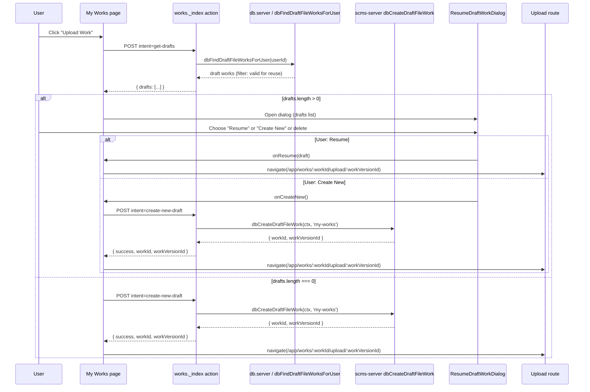

# Upload Work and Upload New Version – Flows and code reference

This document describes the two entry flows for starting or resuming file uploads: **Upload Work** (from the My Works listing) and **Upload New Version** (from a work’s details page). Both flows share the same resume-draft UX (check for existing drafts, show dialog or create new, then redirect to the upload form).

**Contents**

- [Overview](#overview)
- [Upload Work (My Works)](#upload-work-my-works)
- [Upload New Version (Work Details)](#upload-new-version-work-details)
- [Code locations reference](#code-locations-reference)

---

## Overview

| Flow | Trigger | Draft check scope | Creates | Redirect target |
|------|---------|-------------------|---------|-----------------|
| **Upload Work** | “Upload Work” on My Works | All draft *works* for the user (single version, with `checks` metadata) | New **work** + first draft version | `/app/works/:workId/upload/:workVersionId` |
| **Upload New Version** | “Upload New Version” on Work Details | Latest version of **this work** only (if draft and has `checks`) | New draft **version** on existing work | `/app/works/:workId/upload/:workVersionId` |

Both flows:

1. Require the `app.works.upload` scope (button only shown when `canUpload`).
2. First request a “drafts” list (different intent/API per flow).
3. If drafts exist → show **ResumeDraftWorkDialog** (resume one, create new, or delete).
4. If no drafts (or user chooses “Create new”) → create the work/version via action, then redirect to the upload route.

The upload form itself is the same for both: [`works.$workId.upload.$workVersionId`](../app/routes/app/works.$workId.upload.$workVersionId/route.tsx).

---

## Upload Work (My Works)

User is on **My Works** (`/app/works`). They click **Upload Work**. The app checks for any existing **draft works** (whole works that are draft-only and valid for reuse). If any exist, a resume dialog is shown; otherwise a new draft work is created and the user is sent to its upload page.

### Sequence diagram (Upload Work)



### Flow summary (My Works)

1. **Button click**  
   [`handleUploadClick`](../app/routes/app/works._index/route.tsx) submits `intent: 'get-drafts'` to the My Works action.

2. **Check for drafts**  
   Action handles `get-drafts`: calls [`dbFindDraftFileWorksForUser`](../app/routes/app/works._index/db.server.ts), then filters with [`isValidDraftForReuse`](../app/routes/app/works._index/route.tsx) (single version, `checks` in metadata). Returns `{ drafts }` to the client.

3. **Client response**  
   In [`useEffect`](../app/routes/app/works._index/route.tsx): if `drafts.length > 0` → open [`ResumeDraftWorkDialog`](../../../packages/scms-core/src/components/ui/dialogs/ResumeDraftWorkDialog.tsx); else call `handleCreateNew()`.

4. **Create new work**  
   `handleCreateNew` submits `intent: 'create-new-draft'`. Action calls [`dbCreateDraftFileWork`](../../../packages/scms-server/src/backend/db.server.ts) (which uses [`dbCreateDraftWork`](../../../packages/scms-server/src/backend/db.server.ts)). Response includes `workId` and `workVersionId`.

5. **Redirect**  
   On success, another [`useEffect`](../app/routes/app/works._index/route.tsx) runs and navigates to `/app/works/:workId/upload/:workVersionId` (or user resumes a draft and navigates to the same pattern).

6. **Activity**  
   `dbCreateDraftWork` creates one activity with `ActivityType.NEW_WORK` in the same transaction as the work and first version.

---

## Upload New Version (Work Details)

User is on a **work’s details page** (`/app/works/:workId/details`). They click **Upload New Version**. The app checks whether the **latest version of this work** is already a draft (and valid for reuse). If yes, the resume dialog is shown; otherwise a new draft version is created and the user is sent to its upload page.

### Sequence diagram (Upload New Version)

```mermaid
sequenceDiagram
  participant User
  participant Details as Work Details page
  participant Action as works.$workId action
  participant DB as db.server (versions / delete)
  participant Server as scms-server dbCreateDraftWorkVersion
  participant Dialog as ResumeDraftWorkDialog
  participant Upload as Upload route

  User->>Details: Click "Upload New Version"
  Details->>Action: POST intent=get-drafts-for-work
  Action->>DB: dbGetWorkVersionsWithSubmissionVersions(workId)
  DB-->>Action: versions (newest first)
  Note over Action: If versions[0].draft && has 'checks' → 1 draft
  Action-->>Details: { drafts: [...] }

  alt drafts.length > 0
    Details->>Dialog: Open dialog (single draft = latest version)
    User->>Dialog: Choose "Resume" or "Upload New Version" or delete
    alt User: Resume
      Dialog->>Details: onResume(draft)
      Details->>Upload: navigate(.../upload/:workVersionId)
    else User: Upload New Version
      Dialog->>Details: onCreateNew()
      Details->>Action: POST intent=create-new-version
      Action->>Server: dbCreateDraftWorkVersion(ctx, workId, 'work-details')
      Server-->>Action: { workId, workVersionId }
      Action-->>Details: { success, workId, workVersionId }
      Details->>Upload: navigate(.../upload/:workVersionId)
    end
  else drafts.length === 0
    Details->>Action: POST intent=create-new-version
    Action->>Server: dbCreateDraftWorkVersion(ctx, workId, 'work-details')
    Server-->>Action: { workId, workVersionId }
    Action-->>Details: { success, workId, workVersionId }
    Details->>Upload: navigate(.../upload/:workVersionId)
  end
```

### Flow summary (Work Details)

1. **Button click**  
   [`handleUploadNewVersionClick`](../app/routes/app/works.$workId.details/route.tsx) submits `intent: 'get-drafts-for-work'` to the work route action (`/app/works/:workId`).

2. **Check for draft version**  
   Action handles `get-drafts-for-work`: loads versions with [`dbGetWorkVersionsWithSubmissionVersions`](../app/routes/app/works.$workId/db.server.ts). If the latest version is draft and [`isDraftVersionValidForReuse`](../app/routes/app/works.$workId/route.tsx) (has `checks` in metadata), returns that as a single-item `drafts` array; otherwise `drafts: []`.

3. **Client response**  
   In [`useEffect`](../app/routes/app/works.$workId.details/route.tsx): if `drafts.length > 0` → open [`ResumeDraftWorkDialog`](../../../packages/scms-core/src/components/ui/dialogs/ResumeDraftWorkDialog.tsx); else call `handleCreateNewVersion()`.

4. **Create new version**  
   `handleCreateNewVersion` submits `intent: 'create-new-version'`. Action (with upload scope) calls [`dbCreateDraftWorkVersion`](../../../packages/scms-server/src/backend/db.server.ts). Response includes `workId` and `workVersionId`.

5. **Redirect**  
   On success, another [`useEffect`](../app/routes/app/works.$workId.details/route.tsx) navigates to `/app/works/:workId/upload/:workVersionId` (or user resumes and navigates to the same pattern).

6. **Activity**  
   `dbCreateDraftWorkVersion` creates one activity with `ActivityType.WORK_VERSION_ADDED` in the same transaction.

7. **Delete draft (from dialog)**  
   If the user deletes the draft from the dialog, the action handles `delete-draft` (or `delete-all-drafts` with same intent) and calls [`dbDeleteDraftVersionOnWork`](../app/routes/app/works.$workId/db.server.ts), which removes the latest version only if it is a draft with no submission versions, and deletes its storage files.

---

## Code locations reference

Paths are relative to the repository root.

### My Works (Upload Work)

| Purpose | Location |
|--------|----------|
| My Works page, Upload button, action intents, resume dialog wiring | [works._index/route.tsx](../app/routes/app/works._index/route.tsx) |
| Fetch draft works for user; delete draft work | [works._index/db.server.ts](../app/routes/app/works._index/db.server.ts) |
| Create new draft work + first version; create draft file work (with checks) | [scms-server db.server.ts](../../../packages/scms-server/src/backend/db.server.ts) (`dbCreateDraftWork`, `dbCreateDraftFileWork`) |

### Work Details (Upload New Version)

| Purpose | Location |
|--------|----------|
| Work details page, Upload New Version button, resume dialog wiring | [works.$workId.details/route.tsx](../app/routes/app/works.$workId.details/route.tsx) |
| Work route action: get-drafts-for-work, create-new-version, delete-draft | [works.$workId/route.tsx](../app/routes/app/works.$workId/route.tsx) |
| Get versions for work; delete draft version on work | [works.$workId/db.server.ts](../app/routes/app/works.$workId/db.server.ts) |
| Create new draft version on existing work | [scms-server db.server.ts](../../../packages/scms-server/src/backend/db.server.ts) (`dbCreateDraftWorkVersion`) |

### Shared

| Purpose | Location |
|--------|----------|
| Resume draft dialog (list drafts, resume / create new / delete) | [ResumeDraftWorkDialog.tsx](../../../packages/scms-core/src/components/ui/dialogs/ResumeDraftWorkDialog.tsx) |
| Upload form (redirect target for both flows) | [works.$workId.upload.$workVersionId/route.tsx](../app/routes/app/works.$workId.upload.$workVersionId/route.tsx) |

### Action intents (quick reference)

| Intent | Route | Purpose |
|--------|--------|--------|
| `get-drafts` | `POST /app/works` | List user’s draft works (My Works). |
| `create-new-draft` | `POST /app/works` | Create new work + first version (My Works). |
| `delete-draft` | `POST /app/works` | Delete a draft work (My Works). |
| `get-drafts-for-work` | `POST /app/works/:workId` | List draft versions for this work (at most latest). |
| `create-new-version` | `POST /app/works/:workId` | Create new draft version on this work. |
| `delete-draft` | `POST /app/works/:workId` | Delete latest draft version on this work (Work Details dialog). |
